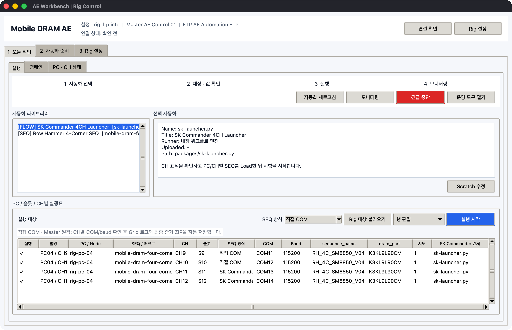
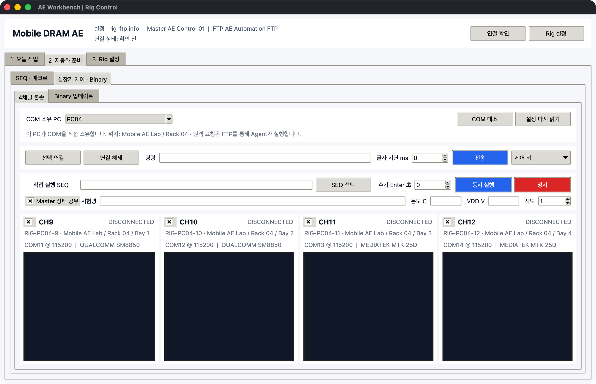
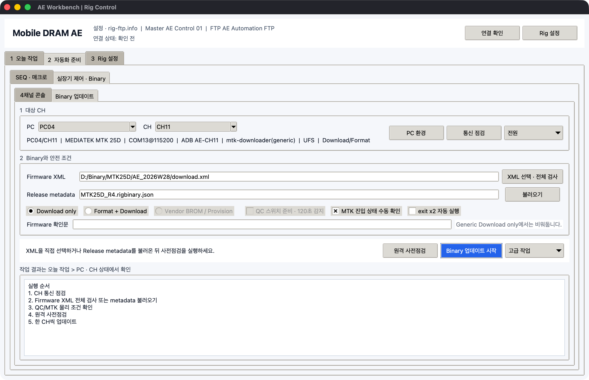

# Win Automation Picker

Windows UI Automation 기반 매크로 제작기와 FTP master/slave 운영 도구입니다. 사내 Windows 프로그램의 버튼, 입력칸, 상태 component를 캡처해 실제 Scratch식 블록으로 조합하고, 실행 가능한 Python 또는 원격 PC용 작업으로 배포합니다.

- 온라인 한글 매뉴얼: https://stpcoder.github.io/win-automation-picker/
- 영문 README: [README.md](README.md)
- 최신 Release: https://github.com/stpcoder/win-automation-picker/releases/tag/latest

## 다운로드

| 파일 | 용도 |
| --- | --- |
| [AEWorkbench.exe](https://github.com/stpcoder/win-automation-picker/releases/latest/download/AEWorkbench.exe) | SEQ, Scratch 매크로, 검증, FTP 배포와 모니터링을 연결한 권장 앱 |
| [WinAutomationPicker.exe](https://github.com/stpcoder/win-automation-picker/releases/latest/download/WinAutomationPicker.exe) | 블록 매크로 제작, 실행, Python export |
| [RigFtpCommander.exe](https://github.com/stpcoder/win-automation-picker/releases/latest/download/RigFtpCommander.exe) | FTP master/slave GUI 운영 |
| [RigFtpCli.exe](https://github.com/stpcoder/win-automation-picker/releases/latest/download/RigFtpCli.exe) | FTP 고급 CLI |
| [RigCommander.exe](https://github.com/stpcoder/win-automation-picker/releases/latest/download/RigCommander.exe) | COM/PowerShell/SSH rig 제어 CLI |

코드 서명이 없는 실행 파일이므로 Windows SmartScreen 경고가 표시될 수 있습니다.

## 주요 기능



- 첫 화면을 `오늘 작업`으로 두고 `자동화 준비`, `Rig 설정`을 업무 빈도에 따라 분리합니다.
- 일일 화면에는 자동화 선택, Rig 대상, 실행·중단·모니터링만 표시하고 raw 업로드는 접어둡니다.
- `AEWorkbench.exe` 하나에서 SEQ recipe/package, Scratch source/Python export와 빠른 매크로 버튼을 `*.aework.json` 작업으로 묶습니다.
- Test Sequence Generator를 현재 recipe로 열고 `SeqTool.exe`를 백그라운드 호출해 오류 검사와 Rig package 빌드를 수행합니다.
- 온도는 자동 계측값이 아니라 SEQ `Conditions`에서 사용자가 정한 목표값이며 `@TF set/run` command로 생성됩니다.
- Rig 화면에서 매크로를 새로 만들거나 불러와 Scratch로 직접 수정하고 이 PC에서 시험/중단할 수 있습니다.
- 감지된 시험 변수를 JSON 없이 `값 편집` 창에서 입력하고 작업별로 저장합니다.
- 빠른 매크로 버튼의 이름/메모와 순서를 원본 매크로를 다시 만들지 않고 수정합니다.
- 검증된 SEQ와 최신 Python 매크로를 한 번에 업로드하고 PC/slot/CH별 실행표로 이어집니다.
- `연속 녹화 시작/정지` 사이 외부 프로그램의 클릭, 입력, 주요 키를 한 번에 기록합니다.
- 입력칸의 최종 UIA 값을 읽어 한글 IME와 붙여넣기를 하나의 입력 블록으로 묶습니다.
- 비밀번호 component의 값은 저장하지 않고 빈 필수 변수로 생성합니다.
- click/type/wait/key 블록을 팔레트에서 작업실로 끌어 놓습니다.
- 블록을 자유롭게 재배치하고 반복/if/AND/OR 컨테이너 안팎으로 이동합니다.
- Scratch는 46px 블록과 2px 연결 간격의 `작게` 보기를 기본으로 사용합니다.
- 드래그 외에도 `위로`, `아래로`, `앞 블록 안으로`, `컨테이너 밖으로` 버튼으로 이동합니다.
- 중첩된 자식 블록도 개별 선택, 이름 변경, 복제, 삭제할 수 있습니다.
- `Ctrl+Z`, `Ctrl+Y`, `Ctrl+D`, Delete 편집을 지원합니다.
- 캡처 직후 블록 이름 입력과 selector 품질 진단으로 이어집니다.
- 동일 exe 창 여러 개를 창 내부 텍스트/정규식으로 구분합니다.
- 텍스트와 색상을 조건 또는 모니터 상태로 읽습니다.
- 사용자 지정 보드, CH/장비명, 상태, 행/열 순서로 모니터 화면을 구성합니다.
- 모니터 규칙을 1회 또는 지정 주기로 평가하고 최근 값과 시간을 표시합니다.
- Excel/Google Sheets에서 복사한 행과 `${name}`, `${col1}`, `${row}` 변수를 사용합니다.
- 녹화한 입력을 `${변수}`로 전환하고 PC별 실행표에서 `PC01=Seq 1`, `PC02=Seq 2`처럼 지정합니다.
- 전체 workflow를 실행 가능한 Python으로 export합니다.
- export workflow는 slave EXE의 내장 엔진으로 실행되어 별도 Python 설치가 필요 없습니다.
- FTP spool을 통해 여러 slave PC에 작업을 배포하고 상태, 결과, screenshot을 회수합니다.
- Master/FTP/실장기 연결 PC/물리 실장기를 4계층으로 구별하고 ID·Windows명·실제 위치·COM/HWID 중복을 검사합니다.
- PC·실장기 목록을 Excel 친화 CSV로 일괄 병합·내보내며 CH9, QC-DL, Main 같은 임의 이름을 지원합니다.
- Test Sequence Generator의 `.rigseq.zip`을 재검증하고 PC/슬롯/CH별 `직접 COM` 또는 SK Commander 런처에 배정합니다.
- 직접 COM과 SK Commander를 같은 상태 모델로 표시하면서 Master 시작과 현장 PC 시작을 구별합니다.
- SK Commander의 SEQ/Load/Start 역할을 검사하고, 현장에서 직접 시작한 시험은 Slave의 읽기 전용 감시로 반영합니다.
- 직접 COM은 Grid별 Temp/VDD 로그와 용량 제한 증거 ZIP을 만들며 serial stream을 FTP로 지속 전송하지 않습니다.
- PC별 자유 CH에 SoC, binary 원본/버전/최신 시각, DRAM 자재, 현재 Test/SEQ, 완료/전체 Grid를 함께 관리합니다.
- Seq Generator의 `.rigbinary.json` 메타데이터를 CH에 불러오며 실제 binary 파일은 복사하지 않습니다.
- 최대 4개 COM을 지속 연결해 실시간 console, 부팅 상태, ASCII/Enter/Ctrl 키를 한 화면에서 봅니다.
- COM을 열기 직전에 예상 HWID를 다시 검사하고, 고유하게 확인된 COM 이동만 자동 변경합니다.
- 선택 CH에 같은 `.seq`를 병렬 전송하고 글자 단위 지연 및 주기 Enter를 설정합니다.
- Master 실행표의 같은 PC·Campaign·attempt 직접 COM 행도 최대 4 CH 병렬 job으로 묶습니다.
- MTK/QC Downloader를 CH별 allowlist로 연결하고 descriptor·payload 전체 지문, USB serial,
  BROM/EDL 물리 조건과 dry-run을 검사합니다.
- Slave 내보내기에서 `rig-ftp.info`와 `rig-commander.config.json`을 함께 생성합니다.

## 실장기 직접 제어와 Binary



`2 자동화 준비 > 실장기 제어 · Binary`에서 이 PC의 최대 4개 COM을 연결합니다. 명령은
출력 가능한 ASCII만 허용하고 Enter, Ctrl+C/0x03, Ctrl+V/0x16은 별도 제어 키로 보냅니다. 선택한
CH에는 같은 `.seq`를 동시에 실행할 수 있습니다.



Binary는 `XML 선택 · 전체 검사`로 descriptor와 참조 payload 전체를 바로 검사하거나,
Master/Slave 경로가 다를 때 Seq Generator의 checksummed `.rigbinary.json`을 불러옵니다.
Qualcomm 물리 Download 스위치는 exact EDL serial이 나타날 때까지 제한 시간 동안 재탐색하고,
Generic MTK는 설정에 따라 한 COM session에서 `exit` 2회와 LK marker를 확인한 뒤 진행합니다.
정적 tool/XML/hash 검사는 한 번만 수행하고 이후에는 USB identity만 가볍게 조회합니다.
COM/baud, 고정 ADB serial과 package 지문을 모두 통과한 한 CH만 실제 Downloader에 전달합니다.

자세한 설정은 [실장기 직접 제어와 Binary](https://stpcoder.github.io/win-automation-picker/device-control/)를 참고하십시오.

## 매크로 빠른 시작

통합 운영은 먼저 [AE Workbench 통합 흐름](https://stpcoder.github.io/win-automation-picker/ae-workbench/)을 따릅니다. 매크로만 만들 때는 다음 순서입니다.

1. `AEWorkbench.exe > 2 자동화 준비 > Scratch 더보기 > 새 매크로 만들기`를 누르거나 `WinAutomationPicker.exe`를 실행합니다.
2. `입력값을 PC별 변수로`를 켜고 `연속 녹화 시작`을 누릅니다.
3. 대상 프로그램에서 평소처럼 입력칸에 값을 넣고 버튼을 클릭합니다.
4. Picker로 돌아와 `녹화 정지`를 누릅니다. 정지 버튼 클릭은 기록에서 제외됩니다.
5. 아래 `녹화 타임라인`에서 앱, component, 입력값과 변수화 여부를 확인합니다.
6. 왼쪽 팔레트에서 `N번 반복` 또는 `만약 ...` 블록을 끌어 놓고 녹화 블록을 안으로 이동합니다.
7. 상단 `실행`으로 기본값을 시험하거나 `Python 내보내기`로 저장합니다.
8. 원격 실행은 `배포 > PC별 실행표`에서 PC마다 macro와 입력값을 지정한 뒤 전송합니다.

연속 녹화는 사용자가 명시적으로 시작한 동안만 활성화되며 상단에 경과 시간과 동작 수가 계속 표시됩니다. 앱 내부 클릭은 제외되고 정지 시 전역 훅이 해제됩니다. 블록 하나만 만들 때는 기존 `클릭 녹화`, `입력 녹화`를 그대로 사용할 수 있습니다.

자세한 흐름은 [기본 매크로 만들기](https://stpcoder.github.io/win-automation-picker/macro-builder/basic-flow/)와 [Scratch식 블록 작업실](https://stpcoder.github.io/win-automation-picker/macro-builder/block-designer/)을 참고하십시오.

## 모니터링 빠른 시작

1. `감시 > 텍스트 상태` 또는 `색상 상태` 블록을 끌어 놓습니다.
2. 상태 component를 클릭합니다. 텍스트나 색상이 기대값으로 자동 샘플링됩니다.
3. 오른쪽에서 `탭`, `장비 / CH`, `표시 상태`를 입력합니다.
4. 복합 판정은 AND/OR 묶음 안으로 조건 블록을 끌어 넣습니다.
5. `모니터링` 탭에서 `한 번 확인` 또는 `자동 시작`을 누릅니다.
6. 규칙 표의 통과/실패, 최근 읽은 값, 최근 확인 시간을 확인합니다.
7. `보드 화면 구성`에서 행/열과 상태 순서를 원하는 대로 바꿉니다.

SK Commander처럼 같은 exe가 4개 떠 있는 경우에는 CH 식별 텍스트 조건과 상태 색상 조건을 AND로 묶을 수 있습니다. CH 이름은 `CH1` 형식으로 고정되지 않으며 `CH9`, `CH11`, `PC04-RIG2`처럼 자유롭게 지정합니다.

자세한 예시는 [조건과 모니터링](https://stpcoder.github.io/win-automation-picker/macro-builder/conditions-monitoring/)을 참고하십시오.

## FTP master/slave

사내 정책상 inbound port를 열 수 없는 환경을 위해 FTP를 공유 spool처럼 사용합니다.

1. master PC에서 `RigFtpCommander.exe`를 실행합니다.
2. `3 Rig 설정 > 연결 구조`에서 Master/FTP/PC/실장기 식별을 검사하고 `Master · FTP`에서 연결 확인을 누릅니다.
3. `실장기 연결 PC > 서버 폴더 준비`로 전용 폴더만 생성합니다.
4. slave별 `.info`를 내보내 각 PC의 exe 옆에 둡니다.
5. slave에서 `이 PC Agent > Agent 시작`을 실행합니다.
6. `1 오늘 작업 > 실행`에서 `Rig 대상 불러오기`를 누르고 각 slave의 macro 또는 SEQ와 변수 값을 정한 뒤 `실행 시작`을 누릅니다.

FTP 연결은 전송 시점에만 열고 닫으며, poll jitter, screenshot 최소 간격, 결과 보관 개수와 Agent 재연결 backoff로 부하를 제한합니다. 등록된 PC의 heartbeat가 끊기면 상태표에 offline으로 남고, 기존 FTP의 다른 폴더는 건드리지 않고 설정한 root 아래만 사용합니다.

- [FTP 구조](https://stpcoder.github.io/win-automation-picker/rig-ftp/overview/)
- [PC · 실장기 · COM 연결 구조](https://stpcoder.github.io/win-automation-picker/fixture-topology/)
- [SEQ Generator와 실장기 실행 연동](https://stpcoder.github.io/win-automation-picker/rig-ftp/seq-integration/)
- [Master 세팅](https://stpcoder.github.io/win-automation-picker/rig-ftp/master-setup/)
- [Slave 세팅](https://stpcoder.github.io/win-automation-picker/rig-ftp/slave-setup/)
- [상태와 screenshot](https://stpcoder.github.io/win-automation-picker/rig-ftp/monitoring/)

## 소스 실행

Windows PowerShell:

```powershell
py -3 -m venv .venv
.\.venv\Scripts\Activate.ps1
python -m pip install -U pip
python -m pip install -e .
python -m win_automation_picker
```

테스트:

```powershell
python -m pip install pytest
python -m pytest -q
```

문서 미리보기:

```powershell
python -m pip install -r requirements-docs.txt
mkdocs serve
```

## Rig Commander CLI

설정 예제를 생성한 뒤 COM, PowerShell remoting, SSH 대상에 명령을 보낼 수 있습니다.

```powershell
RigCommander.exe init-config --output rig-config.json
RigCommander.exe -c rig-config.json list
RigCommander.exe -c rig-config.json run --target rig-pc-01:ch1 status
RigCommander.exe -c rig-config.json device probe --target rig-pc-01:ch1
RigCommander.exe device system-check
```

## 자동 빌드

`main` push 시 GitHub Actions가 테스트 후 다섯 Windows 실행 파일을 빌드하고 `latest` Release asset을 갱신합니다. 문서 변경은 `gh-pages`에 배포됩니다.

## 제한 사항

- native Windows UIA 대상에 맞춰져 있습니다.
- 게임, canvas 기반 앱, 브라우저 DOM, 자체 렌더링 UI는 selector 정보가 부족할 수 있습니다.
- 관리자 권한 프로그램을 자동화할 때 Picker도 같은 권한으로 실행해야 합니다.
- Windows interactive desktop session이 잠기거나 로그오프되면 GUI 자동화와 screenshot이 실패할 수 있습니다.
