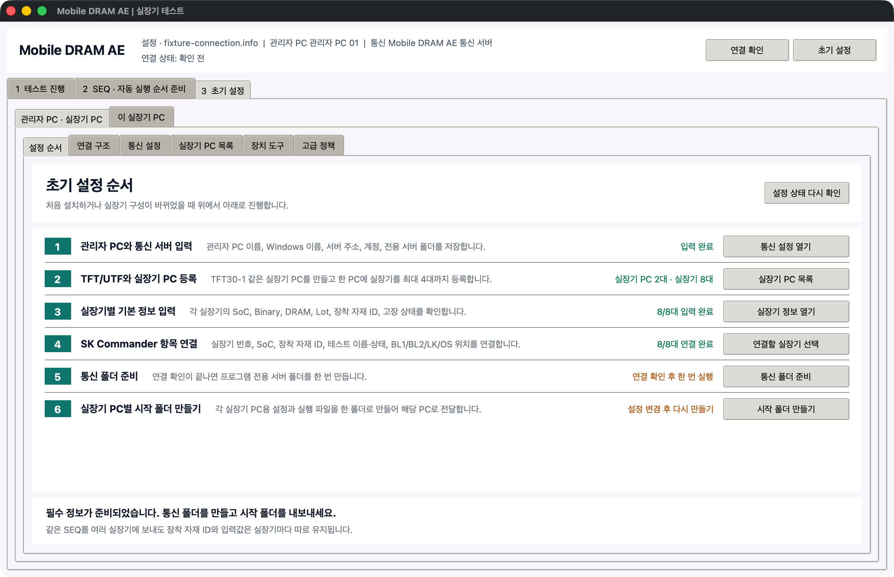
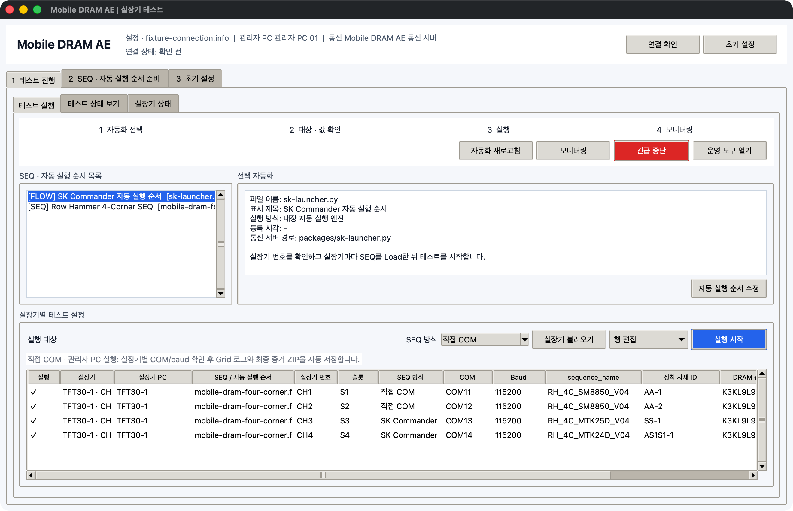
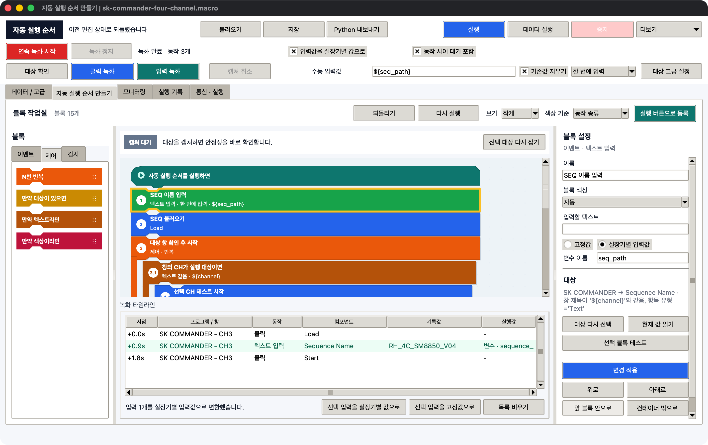
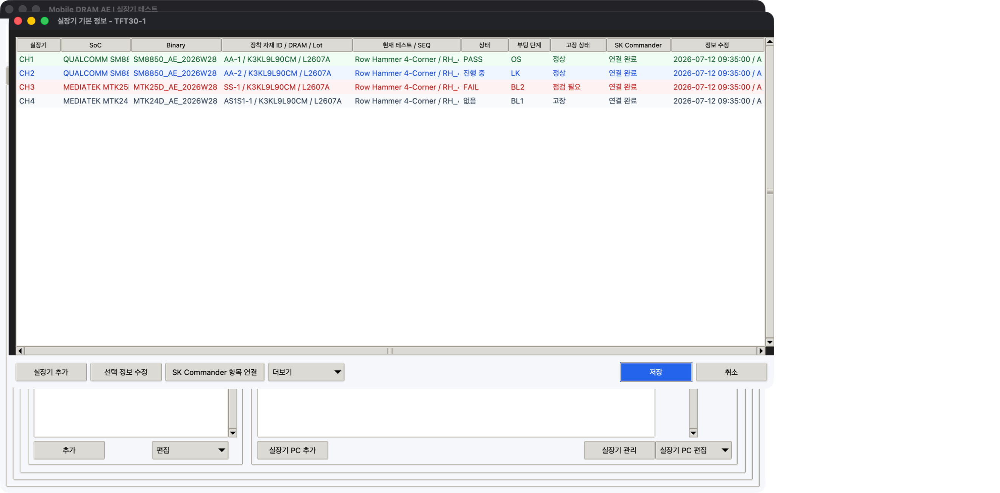
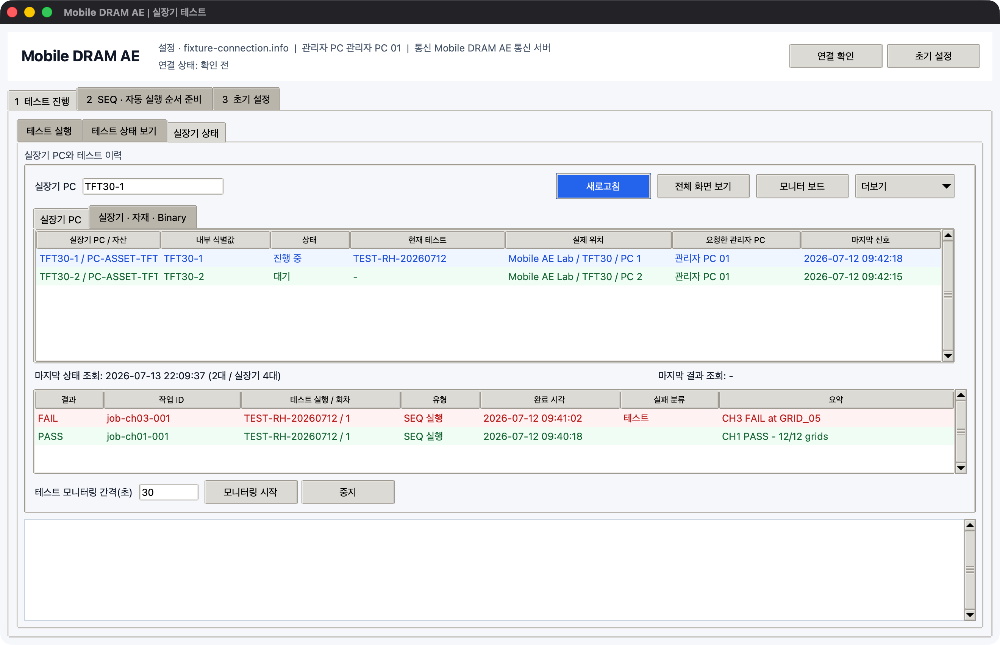

# Mobile DRAM AE 실장기 테스트

Mobile DRAM 테스트에 필요한 SEQ 작성·검사, SK Commander 자동 조작, 직접 COM 제어, 여러 실장기 PC의 테스트 실행과 상태 확인을 한 프로그램에서 처리합니다.

- **검색 가능한 한글 설명서**: https://stpcoder.github.io/win-automation-picker/
- **영문 안내**: [README.en.md](README.en.md)
- **최신 Windows 배포본**: https://github.com/stpcoder/win-automation-picker/releases/tag/latest

## 프로그램 설치 파일

| 파일 | 용도 |
|---|---|
| [AEWorkbench.exe](https://github.com/stpcoder/win-automation-picker/releases/latest/download/AEWorkbench.exe) | 초기 설정, SEQ 준비, 자동 실행 순서, 테스트 실행, 상태 확인을 한 화면에서 처리할 때 |
| [AutomationBuilder.exe](https://github.com/stpcoder/win-automation-picker/releases/latest/download/AutomationBuilder.exe) | 다른 프로그램의 클릭과 입력을 녹화하고 자동 실행 순서로 편집할 때 |
| [FixtureCommunication.exe](https://github.com/stpcoder/win-automation-picker/releases/latest/download/FixtureCommunication.exe) | 실장기 PC에서 통신과 상태 확인 기능만 사용할 때 |
| [FixtureControlCli.exe](https://github.com/stpcoder/win-automation-picker/releases/latest/download/FixtureControlCli.exe) | 직접 COM, 전원, Binary 작업을 명령 창에서 처리할 때 |
| [FixtureCommunicationCli.exe](https://github.com/stpcoder/win-automation-picker/releases/latest/download/FixtureCommunicationCli.exe) | 통신 서버 작업을 명령 창에서 점검할 때 |
| [AEWorkbench-Windows-x64.zip](https://github.com/stpcoder/win-automation-picker/releases/latest/download/AEWorkbench-Windows-x64.zip) | 전체 실행 파일과 검사값 목록이 필요할 때 |

일반 작업자는 `AEWorkbench.exe`만 사용하면 됩니다.

## 현장 구성

```text
관리자 PC
  └─ 통신 서버
      └─ TFT30
          ├─ TFT30-1 ─ CH1, CH2, CH3, CH4
          ├─ TFT30-2 ─ CH5, CH6, CH7, CH8
          ├─ TFT30-3 ─ CH9, CH10, CH11, CH12
          └─ TFT30-4 ─ CH13, CH14, CH15, CH16
```

| 이름 | 의미 |
|---|---|
| 관리자 PC | 테스트를 준비하고 여러 실장기 PC의 상태를 확인하는 PC |
| 통신 서버 | 테스트 요청, 결과, 설정, 요청한 화면을 주고받는 사내 서버의 전용 폴더 |
| TFT/UTF | 여러 실장기 PC가 설치된 단위. 예: `TFT30`, `UTF12` |
| 실장기 PC | 실장기가 최대 4대 연결된 Windows PC. 예: `TFT30-1` |
| 실장기 번호 | 실제 실장기 한 대를 나타내는 번호. 예: `CH1`, `CH11` |

`TFT30-1`은 Windows PC 한 대를 나타냅니다. `CH1`부터 `CH4`는 해당 PC에 연결된 실장기 네 대를 나타냅니다.

## 설명서 구성

설명서는 다음 세 부분으로 나뉩니다. GitHub Pages에서는 왼쪽 목차, 문서 검색, 이전·다음 이동을 제공하는 GitBook형 화면으로 표시됩니다.

1. [초기 설정](docs/index.md): 관리자 PC, 통신 서버, TFT/UTF, 실장기 PC, 실장기, SK Commander 항목을 처음 등록합니다.
2. [테스트 운용](docs/operation/index.md): SEQ와 자동 실행 순서를 준비하고 테스트를 실행하며 상태를 확인합니다.
3. [문제 해결](docs/troubleshooting/index.md): 통신, SK Commander 인식, COM 충돌, SEQ 오류, 중단 후 복구를 확인합니다.

## 초기 설정 절차

1. 관리자 PC에서 `AEWorkbench.exe`를 실행합니다.
2. `3 초기 설정 > 설정 순서`를 엽니다.
3. 통신 서버 주소와 전용 폴더를 입력하고 `연결 확인`을 누릅니다.
4. `TFT30`, `TFT30-1`과 같은 실제 설치 정보를 등록합니다.
5. 각 실장기의 SoC, Binary, DRAM 종류/Part, Lot, 장착 자재 ID, 고장 상태를 입력합니다.
6. 각 SK Commander 창에서 실장기 번호, SoC, 장착 자재 ID, 테스트 이름·상태, 부팅 단계가 표시되는 항목을 연결합니다.
7. `통신 폴더 만들기`와 `시작 폴더 만들기`를 차례로 실행합니다.
8. 각 실장기 PC에서 전달받은 폴더의 `AEWorkbench.exe`를 실행하고 `통신 시작`을 누릅니다.

[초기 설정을 화면별로 보기](docs/index.md)



## 테스트 진행 절차

1. 작성한 SEQ를 불러와 오류를 검사합니다.
2. SK Commander에서 Load, 입력, Start 순서로 조작하면서 자동 실행 순서를 녹화합니다.
3. 잘못 기록된 동작을 지우고, 이름·순서·반복·조건을 편집합니다.
4. 같은 SEQ를 사용할 실장기를 선택합니다.
5. 각 실장기의 장착 자재 ID와 필요한 입력값을 확인합니다.
6. 실행 전 점검을 통과한 뒤 테스트를 시작합니다.
7. 테스트 중에만 모니터링을 켜고 `없음`, `진행 중`, `PASS`, `FAIL`, `중지`를 확인합니다.

같은 SEQ를 여러 TFT/UTF에 보낼 수 있습니다. 이때 `AA-1`, `SS-2`, `AS1S1-1` 같은 장착 자재 ID는 실장기별 값이 유지됩니다.



## 자동 실행 순서 작성

- `연속 녹화 시작`부터 `녹화 정지` 전까지 외부 프로그램의 클릭과 텍스트 입력을 기록합니다.
- 녹화 정지 버튼 자체는 기록하지 않습니다.
- 기록한 블록의 이름을 `SEQ 불러오기`, `장착 자재 ID 입력`, `테스트 시작`처럼 바꿀 수 있습니다.
- 블록을 위아래로 옮기거나 반복·텍스트 조건·색상 조건 안에 넣을 수 있습니다.
- 여러 조건을 AND 또는 OR로 묶을 수 있습니다.
- 입력값을 모든 실장기에 같은 고정값 또는 실장기별 입력값으로 지정할 수 있습니다.
- 완성한 순서를 실행 가능한 Python 파일로 내보낼 수 있습니다.



[자동 실행 순서 상세 설명](docs/operation/prepare.md)

## 실장기별 관리 정보

| 구분 | 값 예 | 입력 방법 |
|---|---|---|
| SoC | MTK24D, MTK25D, SM8850 | 처음 직접 입력한 뒤 SK Commander 항목으로 확인 |
| Binary | 이름, 버전, 원본 폴더 | Binary를 올리거나 확인한 작업자가 직접 입력 |
| 장착 자재 | DRAM Part, Lot, AA-1, SS-2, AS1S1-1 | 작업자가 직접 입력하고 SK Commander 항목으로 확인 |
| 테스트 | 현재 테스트, 사용 중인 SEQ, Grid 진행 수 | 테스트 중 자동 확인 |
| 상태 | 없음, 진행 중, PASS, FAIL, 중지 | 연결한 텍스트 또는 색상 규칙으로 확인 |
| 부팅 단계 | BL1, BL2, LK, OS | SK Commander의 단계 표시로 확인 |
| 고장 상태 | 정상, 사용 주의, 사용 불가, 수리 중, 미확인 | 작업자가 직접 입력 |

Binary와 나머지 기본 정보는 수정 시각을 따로 관리합니다. 관리자 PC에서 Binary를 수정하고 실장기 PC에서 장착 자재를 수정해도, 각각 더 최근에 수정한 값이 유지됩니다.



## 상태 확인

- `새로고침`을 누르면 실장기 PC와 실장기의 최신 상태를 한 번 확인합니다.
- 연속 확인이 필요한 테스트에서만 `모니터링 시작`을 누릅니다.
- 진행 중인 테스트가 없으면 자동 모니터링이 종료됩니다.
- 전체 화면은 관리자가 요청할 때만 한 번 생성합니다.
- 결과, 로그, 화면 파일은 설정된 보관 개수를 넘으면 정리됩니다.
- 실장기 PC별·실장기별 상태를 Excel로 내보낼 수 있습니다.



## 직접 COM과 Binary 업데이트

SK Commander 자동 조작과 직접 COM SEQ 전송을 지원합니다. 같은 실장기의 COM을 두 프로그램에서 동시에 열면 안 됩니다.

Qualcomm QDL과 MediaTek Genio용 외부 다운로드 프로그램은 배포 파일에 포함하지 않습니다. 사내에서 승인한 프로그램의 경로와 명령 형식을 등록하고 한 대에서 검증한 뒤 실행을 허용해야 합니다. Format 또는 제한된 영역 쓰기는 사전 검사와 확인 문구를 통과해야만 실행됩니다.


## 개발 환경 검사

```powershell
python -m pip install -e .
python -m pytest -q
python -m win_automation_picker.ae_workbench
```

`main` 브랜치에 반영되면 GitHub Actions가 전체 테스트와 Windows 실행 파일 빌드를 수행하고 최신 배포 파일을 갱신합니다. 실제 SK Commander 항목 인식, COM 연결, 물리 Download 스위치와 사내 전용 다운로드 프로그램은 대상 Windows PC와 실장기에서 최종 확인해야 합니다.
