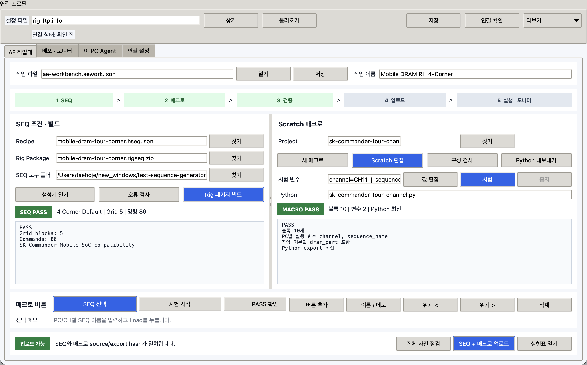
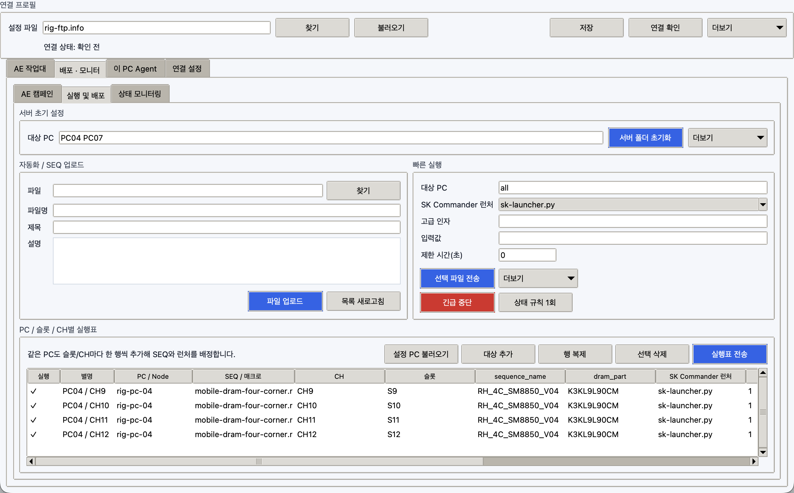

# AE Workbench 통합 작업 흐름

`AEWorkbench.exe`는 SEQ 준비, Scratch 매크로 제작, 사전 점검, FTP 업로드,
PC/CH별 실행과 모니터링을 한 진입 화면으로 연결합니다.



위 예시는 `Mobile DRAM RH 4-Corner` 작업입니다. `SEQ PASS`, `MACRO PASS`,
`업로드 가능`이 동시에 보여야 원격 실행 준비가 끝난 것입니다. `업로드 가능`은
실행을 뜻하지 않으며, 실제 전송은 마지막 `SEQ + 매크로 업로드`를 눌러야 시작됩니다.

## 준비 파일

| 파일 | 역할 |
| --- | --- |
| `AEWorkbench.exe` | 통합 작업대, Rig master/slave, Scratch 편집기 실행 |
| `TestSeqGenerator.exe` | Corner, Temp, VDD, Grid와 command를 편집하는 SEQ GUI |
| `SeqTool.exe` | Workbench가 백그라운드에서 호출하는 SEQ 검사/빌드 도구 |
| `rig-ftp.info` | FTP와 master/slave 설정 |
| `ae-workbench.aework.json` | 현재 SEQ, 매크로, 빠른 버튼 경로를 묶은 작업 파일 |

`TestSeqGenerator.exe`와 `SeqTool.exe`는 서로 같은 폴더에 둡니다. 그 폴더가
`AEWorkbench.exe` 옆 또는 `TestSeqGenerator/` 하위 폴더이면 자동으로 찾습니다.
다른 위치라면 `SEQ 도구 폴더`에서 한 번 선택합니다.

## 1. 작업 파일

1. `AE 작업대`를 엽니다.
2. `작업 파일`에 `*.aework.json` 경로를 적고 `저장`을 누릅니다.
3. `작업 이름`에 시험명을 적습니다.

작업 파일에는 비밀번호가 저장되지 않습니다. FTP 계정은 별도의 `rig-ftp.info`가
관리합니다.

## 2. SEQ 조건과 빌드

1. `Recipe > 찾기`에서 `*.hseq.json`을 선택합니다.
2. `생성기 열기`를 눌러 Test Sequence Generator를 엽니다.
3. Generator의 `Recipe > Conditions`에서 Corner별 `Temp`, `Temp Class`, `VDD`,
   `VDD Class`, `VDD2H`, `VDD2L`을 설정합니다.
4. `Save Recipe`로 저장합니다.
5. Workbench에서 `오류 검사`를 누릅니다.
6. 통과하면 `Rig 패키지 빌드`를 누릅니다.

온도는 Workbench가 자동 계측하는 값이 아닙니다. 사용자가 SEQ의 목표값을 정하면
기본 command template이 `@TF set <Temp>`와 `@TF run <Temp>`를 생성합니다.
현재 `Temp channel`은 장비/slot 식별용 metadata이며 실측 온도 readback이 아닙니다.

오류 검사는 다음 항목을 같은 Generator 엔진으로 확인합니다.

- Grid header와 command body가 각각 한 줄인지
- 각 command가 `;`로 끝나는지
- `;` 다음에 공백이나 tab이 없는지
- 중복 Grid와 빈 command가 없는지
- bootloader, 2nd bootloader, LK, OS 전환에 필요한 `exit` 횟수와 `did` 위치
- 온도, VDD, clock, diagnostic, log, reboot 필수 규칙
- High/Low Temp와 High/Low VDD 4-corner 조합

빌드된 `*.rigseq.zip`에는 SEQ, 정규화된 recipe, validation report, manifest와
원본 recipe SHA-256이 들어갑니다. Recipe가 이후 수정되면 Workbench가 `다시 빌드`로
판정합니다.

## 3. Scratch 매크로

### 새로 만들기

1. `새 매크로`를 누르고 `*.macro.json`을 정합니다.
2. 열린 Scratch 편집기에서 `연속 녹화 시작`을 누릅니다.
3. SK Commander에서 입력과 클릭을 수행합니다.
4. Picker로 돌아와 `녹화 정지`를 누릅니다.
5. 타임라인에서 프로그램/창, component, 동작, 기록값, 실행값을 확인합니다.

녹화 정지 버튼과 Picker 자체 클릭은 매크로에 들어가지 않습니다. 입력값은
`입력값을 PC별 변수로`가 켜져 있으면 `${sequence}`, `${material}` 같은 변수 블록으로
만들 수 있습니다.

### 블록 편집

- 이벤트: 클릭, 텍스트 입력, 키 누르기, 기다리기
- 제어: N번 반복, 대상 존재 조건, 텍스트 조건, 색상 조건
- 감시: 텍스트 상태, 색상 상태, AND 조건 묶음, OR 조건 묶음

팔레트 블록을 중앙 작업실로 끌어 놓고 반복/조건 블록의 안쪽 슬롯에 중첩합니다.
블록을 선택하면 오른쪽에서 이름, 입력값/변수, 조건, 색상 오차, 대상 selector를
수정할 수 있습니다. `선택 블록 시험`은 현재 블록만 실행합니다.

### 저장, 시험, export

1. Picker에서 `저장`을 누릅니다.
2. Workbench에서 `구성 검사`를 누릅니다.
3. `시험 변수 > 값 편집`을 누릅니다.
4. 자동으로 표시된 `channel`, `sequence_name`, `dram_part` 칸에 시험할 값을 적고
   `저장`을 누릅니다. JSON 문법을 직접 입력하지 않습니다.
5. `시험`을 누르면 이 PC에서 실제 매크로가 실행됩니다.
6. 진행 중에는 `중지`로 긴급 중단할 수 있습니다. 정상 중단은 오류 팝업 없이
   `Stopped`로 기록됩니다.
7. `Python 내보내기`를 누릅니다.

시험 변수는 `*.aework.json`에 작업별로 저장됩니다. 원격 PC마다 다른 값은 이 시험
변수가 아니라 뒤의 `PC / 슬롯 / CH별 실행표` 각 행에서 지정합니다.

Scratch source가 export 이후 바뀌면 source SHA-256이 달라져 업로드 버튼이 다시
비활성화됩니다.

## 4. 매크로 버튼

자주 쓰는 매크로는 다음 두 위치에서 등록할 수 있습니다.

- Workbench: `현재 매크로 버튼 만들기`
- Scratch 편집기: `Rig 버튼으로 등록`

버튼 이름은 `SEQ 선택`, `시험 시작`, `결과 저장`처럼 업무 동작으로 정합니다.
등록된 버튼을 누르면 해당 Scratch 프로젝트가 현재 매크로로 선택됩니다. 실수로
즉시 실행되지는 않으며 `시험` 또는 배포 절차를 명시적으로 눌러야 합니다. 버튼은
마지막 Python export 경로와 source hash도 함께 기억하므로 최신 상태라면 다시
내보내지 않아도 됩니다.

- `버튼 추가`: 현재 매크로를 새 버튼으로 등록
- `이름 / 메모`: 선택한 버튼의 업무 이름과 설명 수정
- `위치 <`, `위치 >`: 버튼 순서 변경
- `삭제`: 선택한 버튼만 제거하며 원본 매크로 파일은 삭제하지 않음

## 5. 사전 점검과 업로드

`전체 사전 점검`은 다음 네 항목을 확인합니다.

1. Rig SEQ package 자체 checksum과 validation이 정상인지
2. 현재 recipe가 package 빌드 당시 원본과 같은지
3. Scratch 블록에 빈 selector, 빈 반복/조건 body 같은 오류가 없는지
4. Python export가 현재 Scratch source와 같은지

모두 통과하면 `SEQ + 매크로 업로드`가 활성화됩니다. 이 버튼은 먼저 Picker FLOW를
올리고 다음으로 Rig SEQ package를 올립니다. 업로드가 끝나면 `배포 · 모니터 > 실행 및
배포`의 실행표가 열리고 `SK Commander 런처`가 방금 올린 FLOW로 설정됩니다.

업로드만으로 slave 실행은 시작되지 않습니다. PC/slot/CH와 변수를 마지막으로 확인한
뒤 `실행표 전송`을 눌러야 합니다.

## 6. PC/CH별 실행

`PC / 슬롯 / CH별 실행표`에서 한 행은 한 실행 대상입니다.



| 값 | 예 |
| --- | --- |
| 별명 | `PC04` |
| 대상 | `rig-pc-04` |
| CH | `CH9`, `CH10`, `CH11`, `CH12` |
| SEQ/매크로 | 업로드한 `*.rigseq.zip` |
| SK Commander 런처 | 업로드한 Picker FLOW |
| 변수 | `sequence`, `material`, `channel`, `slot_id` |

같은 PC를 여러 행에 넣어 CH마다 다른 SEQ와 변수값을 배정할 수 있습니다. CH 이름은
숫자 형식으로 고정되지 않습니다.

표의 값을 바꾸려면 해당 셀을 더블클릭합니다. 첫 열의 체크를 끄면 그 행만 전송에서
제외됩니다. `실행표 전송`을 누르기 전에는 slave에 실행 명령이 생성되지 않습니다.

## 7. 서버 FLOW 다시 수정

1. `배포 · 모니터 > 실행 및 배포`에서 `[FLOW]` 항목을 선택합니다.
2. `선택 FLOW를 Scratch에서 수정`을 누릅니다.
3. Workbench가 서버 Python에서 recipe 상수를 안전하게 읽어 `macros/*.macro.json`으로
   복원합니다. Python 코드는 import하거나 실행하지 않습니다.
4. Scratch에서 수정하고 저장한 뒤 다시 export/점검/업로드합니다.

## 상태 해석

| 표시 | 의미 |
| --- | --- |
| `SEQ PASS` | package가 유효하고 현재 recipe와 source hash가 일치함 |
| `MACRO PASS` | Scratch 구성이 유효하고 Python export가 최신임 |
| `업로드 가능` | SEQ와 매크로가 모두 배포 가능한 상태임 |
| `시험 PASS` | 이 PC에서 로컬 매크로 실행이 완료됨 |
| `확인 필요` | 파일 누락, 검증 오류 또는 stale export/package가 있음 |

## 안전 경계

- `오류 검사`는 정적 검사이며 실제 SK Commander 동작 성공을 보장하지 않습니다.
- `시험`은 현재 Windows desktop에서 실제 클릭과 입력을 수행합니다.
- 업로드는 FTP의 설정된 root 아래만 사용합니다.
- slave 실행은 interactive desktop이 잠기거나 로그오프되면 실패할 수 있습니다.
- 관리자 권한 프로그램은 Workbench/Agent도 같은 권한으로 실행해야 합니다.

## 이번 Mac 실제 조작 검증

문서 화면은 정적 목업이 아니라 실제 Tk/Qt 앱에 AE 데모 데이터를 넣어 캡처했습니다.

| 검증 | 결과 |
| --- | --- |
| Scratch 팔레트 drag/drop과 반복 블록 안 삽입 | PASS |
| 선택 블록 이름 변경, 위/아래, 안/밖 이동 | PASS |
| 복제, 삭제, undo, redo | PASS |
| 로컬 wait 매크로 실행 후 `중지` | PASS |
| SEQ Generator Conditions/Run Matrix 탭 전환 | PASS |
| 기본 4-corner recipe Validate | `5 blocks, 86 commands` PASS |
| Workbench source/export 및 recipe/package hash gate | PASS |

Mac에는 Windows UI Automation이 없으므로 실제 SK Commander component 녹화·클릭·입력은
검증 대상이 아닙니다. 이 부분은 배포 전 Windows 시험 PC 한 대에서 확인해야 합니다.

화면을 다시 생성하려면 두 저장소에서 다음을 실행합니다.

```bash
cd win-automation-picker
.venv/bin/python scripts/capture_manual_screenshots.py

cd ../test-sequence-generator
.venv/bin/python scripts/capture_manual_screenshots.py \
  --output-dir ../win-automation-picker/docs/assets/screenshots
```
