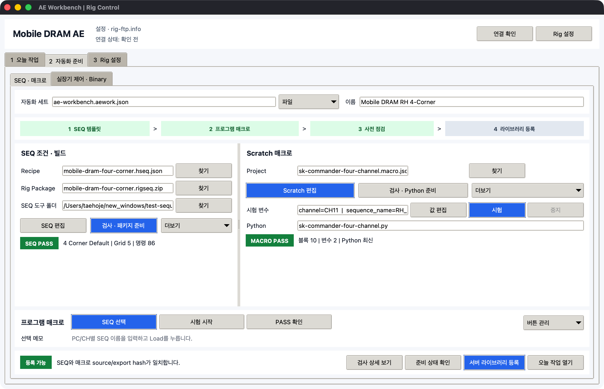
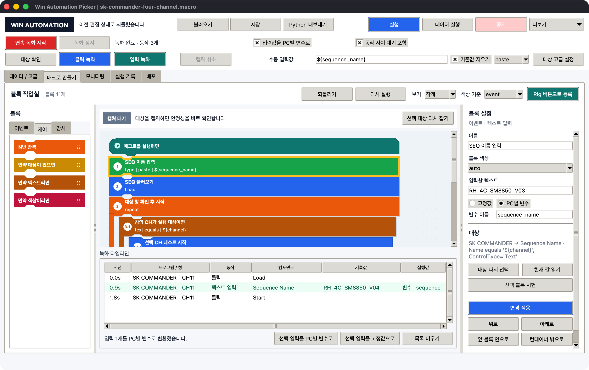
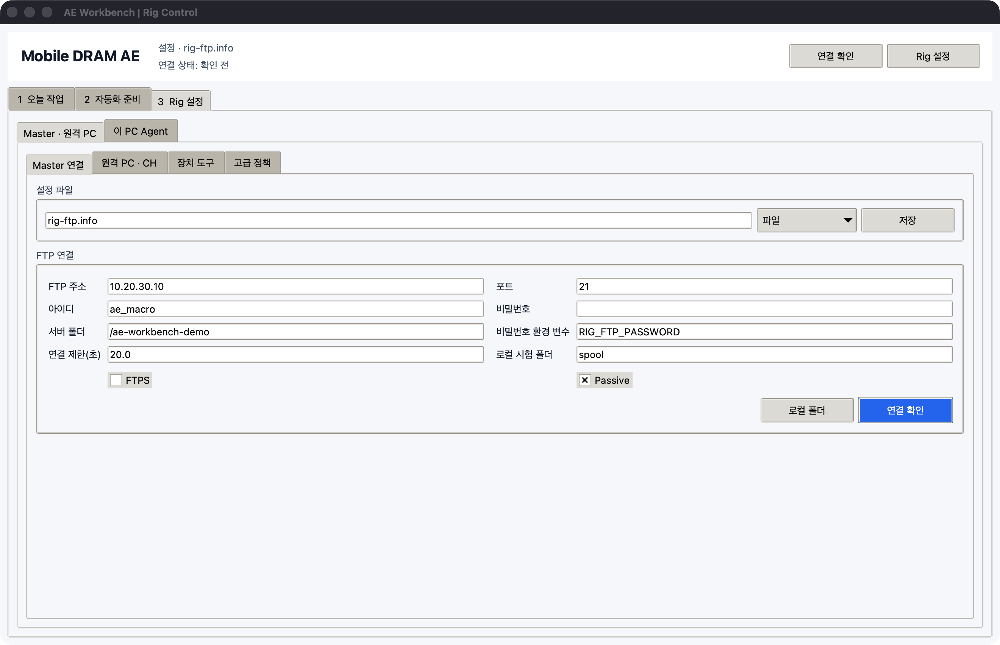
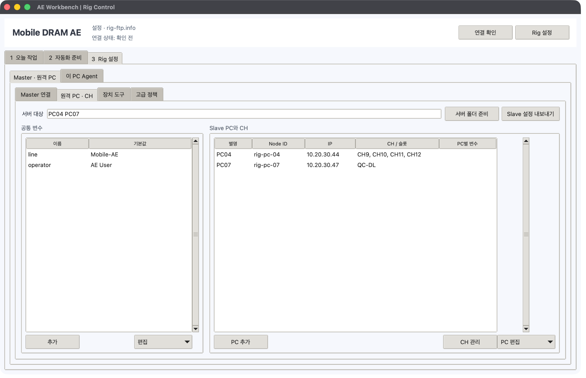
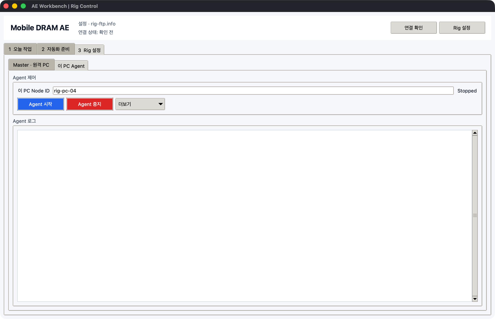
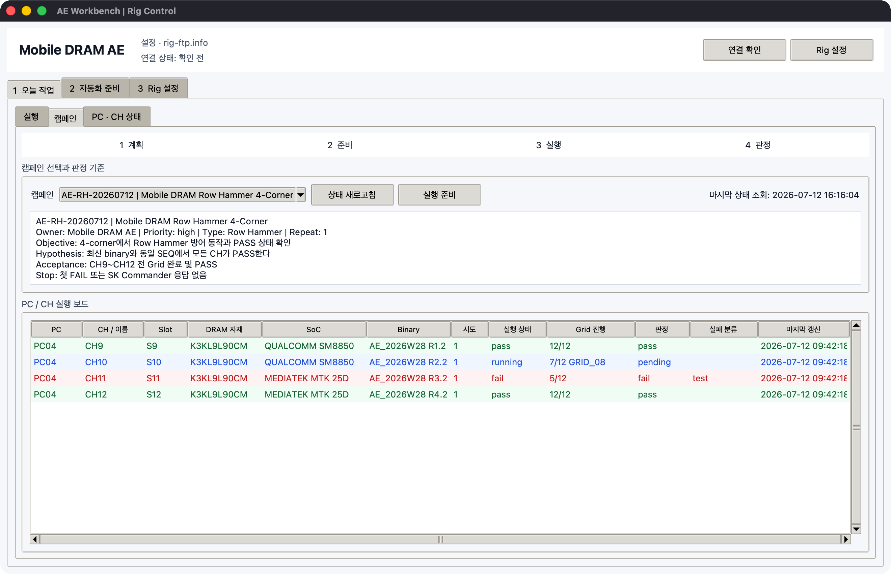
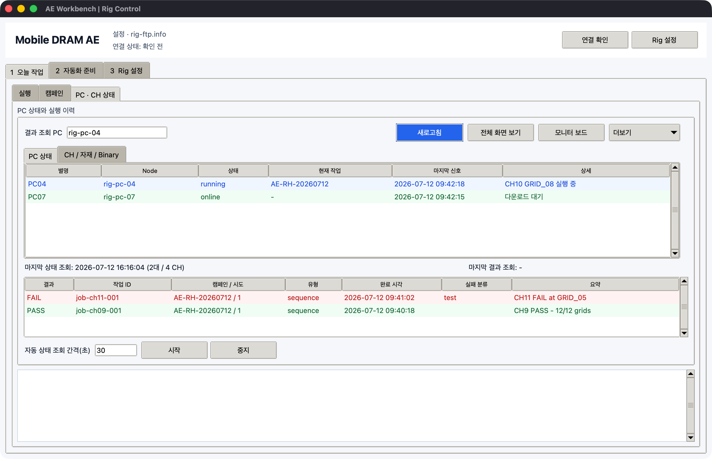

# Mobile DRAM AE 업무 흐름

AE Workbench는 모든 기능을 매일 사용하는 프로그램이 아닙니다. 업무 빈도에 따라
`자동화 준비`, `Rig 설정`, `오늘 작업`을 분리합니다.

| 시점 | 화면 | 완료 기준 |
| --- | --- | --- |
| 프로그램을 처음 자동화할 때 | `2 자동화 준비` | SEQ와 프로그램 매크로가 서버 라이브러리에 등록됨 |
| Rig PC를 추가하거나 바꿀 때 | `3 Rig 설정` | Master 연결, PC/CH inventory, Slave Agent 준비 완료 |
| 매일 시험을 시작할 때 | `1 오늘 작업 > 실행` | 자동화와 PC/CH별 값 확인 후 실행 시작 |
| 시험 중·시험 후 | `1 오늘 작업 > 캠페인`, `PC · CH 상태` | Grid, PASS/FAIL, 실패 원인과 재실행 여부 확인 |

## A. 프로그램별 자동화 준비

이 과정은 SK Commander, Qualcomm downloader, MTK downloader처럼 자동화할 프로그램이나
업무 절차가 추가·변경됐을 때만 수행합니다.



1. `2 자동화 준비`를 엽니다.
2. `파일 > 자동화 세트 열기` 또는 새 `*.aework.json` 경로를 정합니다.
3. `SEQ 편집`에서 Corner, 목표 Temp/VDD, Grid와 command를 저장합니다.
4. `검사 · 패키지 준비`로 `*.rigseq.zip`을 만듭니다.
5. `Scratch 편집`에서 대상 프로그램을 연속 녹화하고 블록을 정리합니다.
6. `값 편집`에서 한 PC로 시험할 `channel`, `sequence_name`, 자재값을 입력합니다.
7. `시험`으로 실제 클릭·입력을 한 번 확인합니다.
8. `검사 · Python 준비`로 최신 FLOW를 만듭니다.
9. `버튼 관리 > 현재 매크로 등록`에서 업무명과 메모를 저장합니다.
10. `준비 상태 확인` 후 `서버 라이브러리 등록`을 누릅니다.

프로그램 매크로 이름은 파일명이 아니라 사람이 선택할 업무명으로 정합니다.

```text
SK Commander · SEQ Load
SK Commander · 시험 시작
Qualcomm · Format + Download
MTK · Preloader exit 후 Download
```

등록된 이름과 메모는 `오늘 작업`의 자동화 라이브러리에 표시됩니다. 서버 등록만으로
원격 PC가 실행되지는 않습니다.

## Scratch 블록 정리



- `보기=작게`가 기본값입니다. 일반 블록 높이는 46px, 스택 간격은 2px입니다.
- `보기=보통`은 블록 이름이나 조건을 더 크게 확인할 때만 사용합니다.
- 위아래 결합 홈이 맞닿아 있으면 같은 실행 스택입니다.
- 반복·조건의 주황색 또는 조건색 외곽 안에 들여쓰기된 블록은 자식입니다.
- 드래그 중 하늘색 결합선과 영역이 나타난 위치에 놓입니다.
- 드래그가 어려우면 `위로`, `아래로`, `앞 블록 안으로`, `컨테이너 밖으로`를 사용합니다.

입력 문자열은 고정값 또는 `${sequence_name}` 같은 PC별 변수로 바꿀 수 있습니다.
원격 PC마다 다른 값은 매크로를 복제하지 않고 일일 실행표에서 입력합니다.

## B. Master와 Rig 최초 설정

### Master 연결



1. `3 Rig 설정 > Master · 원격 PC > Master 연결`을 엽니다.
2. 설정 파일, FTP 주소·포트·아이디·서버 폴더를 입력합니다.
3. 비밀번호는 가능하면 `비밀번호 환경 변수`로 지정합니다.
4. `연결 확인`으로 전용 root의 쓰기·읽기·삭제 권한을 검사합니다.
5. 설정 파일 영역의 `저장`을 누릅니다.

### 원격 PC와 CH 등록



1. `원격 PC · CH`를 엽니다.
2. `PC 추가`로 `PC04`, `rig-pc-04`, IP와 PC별 값을 등록합니다.
3. PC를 선택하고 `CH 관리`에서 `CH9~CH12`, Slot, COM, SoC, Binary, 자재를 등록합니다.
4. CH가 없는 프로그램은 `QC-DL`, `Main` 같은 자유 이름을 사용합니다.
5. `서버 폴더 준비`로 각 Node의 FTP spool 폴더를 만듭니다.
6. `장치 도구`에서 검증된 MTK/QC Downloader와 결과 규칙을 등록합니다.
7. `Slave 설정 내보내기`로 PC별 `rig-ftp.info`와 `rig-commander.config.json`을 생성합니다.

### Slave Agent



각 원격 PC에 `AEWorkbench.exe`, 해당 PC용 `rig-ftp.info`,
`rig-commander.config.json`을 같은 폴더에 둡니다.
`3 Rig 설정 > 이 PC Agent`에서 Node ID를 확인하고 `Agent 시작`을 누릅니다. 평소에는
창을 유지하고, `한 번 확인`과 `중단 신호 해제`는 `더보기`에서 사용합니다.

## 실장기 직접 제어와 Binary


- 실장기 PC에서 `2 자동화 준비 > 실장기 제어 · Binary > 4채널 콘솔`을 엽니다.
- 선택 CH를 연결하고 ASCII 명령, Enter/Ctrl+C, 문자 지연 또는 검증된 SEQ를 보냅니다.
- Master에서 Binary를 바꿀 때는 같은 작업 영역의 `Binary 업데이트`를 사용합니다.
- 한 CH씩 PC 환경·통신·XML hash·Vendor 조건을 점검한 후 실행합니다.

전체 절차는 [실장기 직접 제어와 Binary](device-control.md)를 따릅니다.

## C. 매일 시험 시작


1. Master PC에서 AE Workbench를 실행합니다.
2. 상단 `연결 확인`으로 FTP와 Agent 상태를 확인합니다.
3. `1 오늘 작업 > 실행`에서 `자동화 새로고침`을 누릅니다.
4. 자동화 라이브러리에서 `[FLOW]` 프로그램 매크로와 `[SEQ]`를 확인합니다.
5. 실행할 `[SEQ]`를 선택합니다.
6. `SEQ 방식`에서 `직접 COM` 또는 `SK Commander`를 고릅니다.
7. `Rig 대상 불러오기`로 PC/CH 행을 만듭니다.
8. CH, COM, baud, `sequence_name`, 자재와 attempt를 확인·수정합니다.
9. `SK Commander` 방식이면 각 행의 launcher도 확인합니다.
10. 제외할 행은 첫 열 체크를 끕니다.
11. `실행 시작`을 누릅니다.

한 행은 한 PC/CH/attempt입니다. PC01과 PC02가 다른 SEQ를 사용해도 같은 매크로를
재사용하고 실행표 값만 다르게 입력합니다.

`직접 COM` 행은 같은 PC·Campaign·attempt 기준 최대 네 개가 한 묶음으로 동시에 실행됩니다.
`SK Commander` 행은 Windows UI 포커스 충돌을 피하기 위해 Slave가 순서대로 런처를 실행합니다.

`운영 도구 열기`는 다음 저빈도 기능만 표시합니다.

- 파일을 서버 라이브러리에 직접 등록
- 한 PC에 선택 파일만 전송
- raw 인자·제한 시간 입력
- 상태 규칙만 한 번 실행

일반적인 일괄 시험에서는 열 필요가 없습니다.

## D. 모니터링과 반복

### 캠페인 판정



`캠페인`에서 목적, 가설, Acceptance, Stop 조건을 먼저 확인합니다. `상태 새로고침`은
기존 heartbeat만 읽으며 새 명령이나 화면 캡처를 발생시키지 않습니다.

### PC와 CH 상태



1. `PC · CH 상태`에서 `새로고침`을 누릅니다.
2. PC 상태에서 online/offline, 현재 작업, 마지막 신호를 확인합니다.
3. `CH / 자재 / Binary`에서 Grid, 자재, Binary와 각 CH 상태를 확인합니다.
4. 실패 행은 결과표에서 더블클릭해 로그를 봅니다.
5. 화면이 필요할 때만 `전체 화면 보기`를 누릅니다.
6. 즉시 멈춰야 하면 오늘 실행 화면의 `긴급 중단`을 사용합니다.
7. 원인을 수정한 뒤 오늘 실행표에서 실패 행만 켜고 다시 `실행 시작`을 누릅니다.

자동 새로고침은 heartbeat와 결과 파일만 읽습니다. 실시간 영상이나 지속 screenshot을
전송하지 않으므로 FTP와 원격 PC 부하를 제한합니다.

## E. 업무 종료

1. `PC · CH 상태 > 더보기 > Excel 내보내기`로 현재 상태를 저장합니다.
2. 실패 결과는 `선택 결과 분류`에서 test/setup/automation/infrastructure로 분류합니다.
3. 장기 보관이 필요 없는 화면·로그는 보관 정책에 따라 정리합니다.
4. Agent는 다음 업무에도 사용할 PC라면 실행 상태로 유지합니다.

## 기능 노출 원칙

| 기본 화면에 보임 | 메뉴·접힌 영역에 있음 |
| --- | --- |
| 자동화 선택, Rig 대상 불러오기, 실행 시작 | raw 파일 업로드, 단일 PC 인자 실행 |
| 모니터링, 새로고침, 긴급 중단 | 개별 상태/결과 새로고침, cleanup |
| SEQ 편집·패키지 준비, Scratch 편집·Python 준비 | 개별 검사, 다른 파일 선택 |
| PC 추가, CH 관리, Slave 설정 내보내기 | polling jitter, 보관 개수, 외부 Python |

이 구분은 기능 삭제가 아니라 업무 빈도에 따른 점진적 노출입니다.
