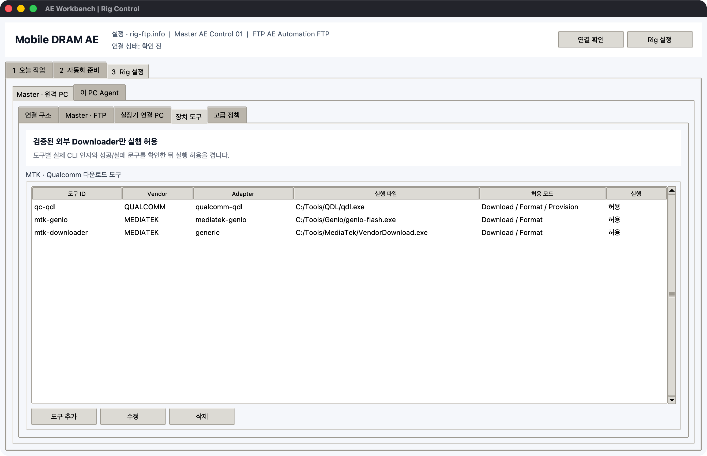
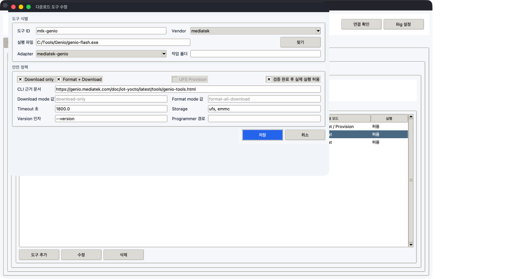
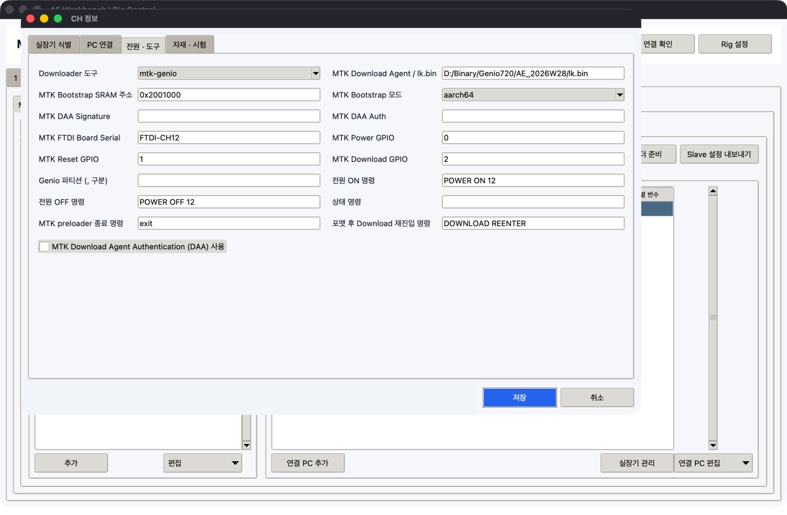

# 실장기 직접 제어와 Binary 업데이트

`2 자동화 준비 > 실장기 제어 · Binary`는 SK Commander 화면 매크로와 별개로
COM에 직접 연결하는 작업 영역입니다. 한 PC에 연결된 최대 4개 실장기를 동시에 보고,
검증된 외부 MTK/Qualcomm Downloader를 한 CH씩 실행합니다.

## 통신 구조

| 작업 | 실행 위치 | 통신 방식 |
| --- | --- | --- |
| 실시간 4채널 콘솔 | COM이 실제 연결된 Slave PC | pyserial 지속 연결 |
| 같은 SEQ 동시 전송 | 해당 Slave PC | CH별 독립 thread와 COM |
| 전원·통신·Binary 요청 | Master에서 선택한 Slave로 제출 | FTP의 짧은 job 파일 |
| 결과 확인 | Master | FTP 결과·로그 새로고침 |

FTP는 실시간 터미널 스트림으로 사용하지 않습니다. Slave Agent는 poll할 때만 FTP에
접속하고, 콘솔 수신은 로컬 메모리에서 처리하므로 다른 FTP 사용자의 연결을 계속
점유하지 않습니다.

## 최초 CH 설정

1. `3 Rig 설정 > Master · 원격 PC > 실장기 연결 PC`를 엽니다.
2. PC를 선택하고 `실장기 관리`를 누릅니다.
3. `실장기 식별` 탭에서 물리 실장기 ID, Model, Serial, 실제 위치와 자유 CH/Slot을 입력합니다.
4. `PC 연결` 탭에서 Console COM, baud, 예상 HWID와 USB Hub/Port를 입력합니다.
5. 필요하면 `ADB 사용`을 켜고 ADB serial, Download COM, USB 식별자와 전원 명령을 입력합니다.
6. MTK에서 실제로 검증한 명령이 있을 때만 `preloader 종료 명령`을 입력합니다.

CH 이름은 `CH1`로 고정되지 않습니다. `CH9`, `CH11`, `QC-DL`, `PC04-RIG2`를 그대로
사용할 수 있습니다. 한 PC의 Console COM은 서로 달라야 합니다.

## 4채널 콘솔


1. 실장기 PC에서 `AEWorkbench.exe`를 실행합니다.
2. 상단 Node ID와 같은 PC를 선택합니다.
3. 사용할 CH 체크를 켜고 `선택 연결`을 누릅니다.
4. 각 패널에서 `COM @ baud`, SoC와 현재 부팅 상태를 확인합니다.
5. 공통 명령을 입력하고 `전송`을 누릅니다.

`COM 대조`는 Windows가 현재 감지한 port, description, HWID와 USB location을 설정값과
비교합니다. 예상 HWID가 다른 COM에서 정확히 한 번만 발견될 때만 `안전한 COM 변경 적용`이
활성화됩니다. 여러 COM에 동시에 일치하거나 설정 COM이 다른 하드웨어이면 자동 변경하지
않습니다.

수동 콘솔, 직접 COM SEQ와 전원 명령은 실제 COM을 열기 직전에 같은 HWID 검사를 다시
수행합니다. 전체 식별 체계와 이동 절차는 [PC · 실장기 · COM 연결 구조](fixture-topology.md)를
따릅니다.

입력칸은 출력 가능한 ASCII만 받습니다. `;`, `-`, `_`, `/`, `0x`는 사용할 수 있지만
한글과 제어 문자는 거부합니다. 제어 문자는 `제어 키`에서 보냅니다.

| 컨트롤 | 동작 |
| --- | --- |
| `Enter` | CH에 설정된 CRLF 전송 |
| `Ctrl+C 중단 문자` | `0x03` 전송 |
| `Ctrl+V 제어 문자 (0x16)` | terminal control byte `0x16` 전송 |
| `클립보드 ASCII 붙여넣기` | 검증된 ASCII를 명령 입력칸에 넣고 전송 전에 확인 |
| `exit 2회` | 150 ms 간격으로 `exit`와 Enter를 두 번 전송해 boot context 전환 |
| `글자 지연 ms` | 불안정한 입력을 한 byte씩 지연 전송 |
| `주기 Enter 초` | 0이면 꺼짐, 양수이면 CH별 keepalive Enter |

수신 버퍼에서 최신 marker를 찾아 `PRELOADER`, `BOOTLOADER`, `LK`, `OS CONSOLE`,
`OS LOGIN`으로 표시합니다. 예를 들어 `LK2]`가 들어오면 `LK`가 표시됩니다. marker가
없어도 원문은 콘솔에 계속 남습니다. 메모리는 CH별 최대 약 256 KB, 화면은 최근 5,000줄로
제한되어 장시간 실행해도 무한히 커지지 않습니다.

### SEQ 직접 실행

1. `SEQ 선택`에서 검증된 `.seq`를 고릅니다.
2. 실행할 CH만 체크합니다.
3. Master에서 함께 볼 시험이면 `Master 상태 공유`를 켭니다.
4. 시험명과 필요 시 온도, VDD, 시도를 입력합니다.
5. `동시 실행`을 누릅니다.
6. 각 Grid와 command의 `PASS` 또는 `FAIL` 진행을 패널에서 확인합니다.
7. 중단이 필요하면 `정지`를 누릅니다.

Grid header `#...`는 로그 구간으로 사용하고, command는 `;`로 나눕니다. 선택 CH는
서로 다른 thread에서 실행되므로 네 장치가 순서대로 기다리지 않습니다. 같은 COM을 다른
터미널이나 SK Commander가 열고 있으면 연결이 실패하므로 먼저 해당 COM을 닫아야 합니다.
현장 SEQ 규칙에 맞지 않는 `cmd1; cmd2;` 형태의 구분자 뒤 공백과 마지막 `;` 누락은
전송 전에 차단합니다.
SEQ 실행 중에는 주기 Enter와 수동 명령이 자동으로 잠시 중지됩니다. 최근 TX/RX와 command
판정은 `work_dir/serial-results/{job_id}/manifest.json`, `console.log`, `grids/*.log`에
CH별로 저장됩니다. console 기본 상한은 8 MB, Grid log는 Grid당 2 MB·실행당 합계 32 MB이며
결과 JSON의 command 응답은 최근 4 KB를 포함합니다. 로컬 실행 폴더는 기본 최근 40개만
유지하고 Workbench manifest를 가진 전용 폴더만 정리합니다.

### Master에서 직접 COM SEQ 배포


1. Generator에서 검사한 `*.rigseq.zip`을 서버 라이브러리에 등록합니다.
2. `1 오늘 작업 > 실행`에서 `[SEQ]`를 선택합니다.
3. `SEQ 방식`을 `직접 COM`으로 바꾸고 `Rig 대상 불러오기`를 누릅니다.
4. 각 행의 CH, COM, baud, SEQ와 자재 값을 확인합니다.
5. 제외할 CH의 첫 열 체크를 끄고 `실행 시작`을 누릅니다.

Master는 같은 Node, Campaign ID, attempt의 직접 COM 행을 한 job으로 묶습니다. Slave는 서로
다른 COM인지 다시 검사한 뒤 최대 4개 CH를 독립 thread에서 동시에 실행합니다. attempt 1과
attempt 2는 별도 묶음이므로 반복 순서는 유지됩니다. 행별 방식을 바꾸려면 해당 행을 선택한
뒤 상단 `SEQ 방식`을 바꾸거나 `SEQ 방식` 셀을 더블클릭합니다.

Slave는 Grid/command 진행을 heartbeat에 기록하고, 최종 CH별 manifest, Grid log와 console을
`work_dir/serial-results/{job-CH}/`에 저장합니다. 종료 시 용량 제한 증거 ZIP을 한 번만
FTP에 올리며 raw serial stream을 실시간 socket처럼 계속 전송하지 않습니다.

## Downloader 도구 등록





`3 Rig 설정 > Master · 원격 PC > 장치 도구`에서 Downloader를 등록합니다. Adapter는 다음
세 종류입니다.

| Adapter | 실행기 | 용도 |
| --- | --- | --- |
| `qualcomm-qdl` | open-source `qdl.exe` | EDL/Firehose, rawprogram/patch, UFS provisioning |
| `mediatek-genio` | MediaTek `genio-flash.exe` | BROM Download Agent, eMMC/UFS image와 partition |
| `generic` | 현장에서 검증한 Vendor CLI | 비공개 MTK/QC 도구와 사내 Downloader |

1. Vendor와 `.exe` 경로를 정합니다.
2. QDL/Genio이면 해당 built-in Adapter를 고릅니다.
3. Generic일 때만 인자를 한 줄에 하나씩 입력합니다.
4. `{xml}`, `{port}`, `{mode}`, `{channel}`, `{adb_serial}` placeholder를 사용합니다.
5. 도구가 요구하는 Download/Format mode 값과 timeout을 입력합니다.
6. 실제 버전의 `--help` 또는 사내 문서를 `CLI 근거 문서`에 기록합니다.
7. Generic이면 성공 문구와 실패 문구를 각각 한 줄 이상 등록합니다.
8. 현장 dry-run을 확인한 뒤에만 `실제 실행 허용`을 켭니다.

QDL/Genio Adapter는 실행 전에 `--version`, `--help`와 필요한 option을 확인하고 모든
dry-run을 erase보다 먼저 수행합니다. Generic은 등록한 CLI의 exit code·성공 문구·실패
문구를 검사합니다. 비공개 SP Flash Tool 계열 인자는 추측하지 않으므로 Generic에 현장
근거대로 등록해야 합니다.

`mediatek-genio`는 Genio Tools가 공식 지원하는 board/image에만 사용합니다. `MTK25D`처럼
사내 실장기 SoC라는 이유만으로 Genio 호환으로 간주하지 않으며, 해당 장비는 Vendor CLI의
실제 `--help`와 시험 결과를 확보해 `generic` profile로 등록합니다.

Generic 도구가 한 명령으로 format과 download를 모두 수행하면 `CLI 인자`만 사용합니다.
이 경우에도 version과 한 개의 파괴 단계를 가진 fingerprinted plan으로 변환하므로 확인문과
실행 직전 descriptor/payload 재해시를 건너뛰지 않습니다.
formatter와 downloader가 별도 명령이면 `단계별 인자`의 Format/Download를 각각 입력하고
CH에 `포맷 후 Download 재진입 명령`을 등록합니다. 실행 순서는 version, format, 재진입,
정확한 Download identity 재탐색, download로 고정됩니다. 재진입 명령이 성공해도 설정한
USB identity가 제한 시간 안에 다시 나타나지 않으면 download를 시작하지 않습니다.

비공개 MTK BROM uploader가 DA를 특정 SRAM 주소에 올리는 별도 CLI를 제공하면 Generic의
`Provision (Generic)` 인자에 실제 근거대로 등록합니다. `{bootstrap_path}`,
`{bootstrap_address}`, `{bootstrap_mode}`, `{port}`, `{channel}` placeholder를 사용할 수 있고,
Binary 화면에는 `Vendor BROM / Provision`으로 표시됩니다. 공개 Genio의 DA bootstrap은
`genio-flash` download 흐름 자체에 포함되므로 이 별도 모드를 사용하지 않습니다.

## Seq Generator 준비

Test Sequence Generator의 `Provision` 탭에서 다음 값을 설정합니다.

- Vendor, SoC, Binary root와 XML
- 대상 Slot/CH, Console COM과 baud
- 예상 USB/COM Download 식별자
- 여러 ADB 장치 중 하나를 고정하는 ADB serial
- Download 후 ADB online을 필수로 볼지 여부
- Downloader ID와 실제 경로

`Build Preflight Plan`이 `READY`인지 확인하고 `Export Release Metadata`로
`*.rigbinary.json`을 만듭니다. 파일에는 XML 경로와 SHA-256, 원본 폴더, COM/baud/ADB
힌트, MTK 진입 명령·횟수·간격·marker, USB 감지 제한 시간이 들어가며 proprietary
binary 파일 자체는 복사하지 않습니다.

## Binary 업데이트


1. Master에서 대상 PC와 CH를 선택합니다.
2. `PC 환경`으로 Windows, PowerShell과 serial backend를 점검합니다.
3. `통신 점검`으로 대상 COM과 ADB 상태를 확인합니다.
4. 같은 PC나 공유 폴더의 descriptor라면 `XML 선택 · 전체 검사`를 누릅니다.
5. Master와 Slave의 경로가 다르면 대신 `*.rigbinary.json`을 불러오고 Slave XML 경로를 확인합니다.
6. Vendor의 물리 조건을 확인합니다.
7. `원격 사전점검`을 실행합니다.
8. 결과가 PASS일 때 `Binary 업데이트 시작`을 누릅니다.

직접 XML 선택은 descriptor SHA-256과 참조 payload/programmer 전체 지문을 계산하고 READY
요약을 표시합니다. Metadata 방식에서는 Vendor/SoC와 CH 프로필이 다르면 제출 단계에서
차단됩니다. 두 방식 모두 Slave에서는 다시
Downloader 경로, descriptor SHA-256, 참조 image/programmer/Download Agent 전체 지문,
COM, USB Download 식별자, 허용 모드와 도구 capability를 확인합니다. Built-in Adapter는
Download only도 사전점검에 표시된 `FLASH PC:CH 지문12자리` 확인문이 필요합니다.
직접 검사 결과는 검사 당시의 `PC:CH`에 묶입니다. 검사 중 파일이나 CH를 바꾸거나 검사 후
다른 CH로 이동하면 이전 READY 결과를 폐기하고 현재 CH에서 다시 검사해야 합니다.

### Qualcomm

- 물리 Download/EDL 스위치를 실제로 누르거나 고정한 뒤 체크합니다.
- 시작 후 EDL 장치가 늦게 나타나도 CH의 `USB Download 대기 초` 동안 exact serial을
  재탐색합니다. 도구 version, XML 경로와 hash는 첫 시도에 한 번 검사하고 이후에는 USB
  identity/EDL serial만 가볍게 조회합니다. 제한 시간이 지나면 Downloader를 실행하지 않습니다.
- CH의 Download 식별자와 `EDL / Download Serial`을 모두 저장합니다. QDL은 Serial이
  없으면 첫 장치를 임의 선택할 수 있으므로 실행을 차단합니다.
- 여러 장치가 연결됐을 때 ADB 명령은 항상 CH의 serial을 사용합니다.
- Built-in QDL 계획은 upstream commit `a00d81bc639908875862582f0d3cb0775d92e269`
  (`v2.7-44-ga00d81b`)의 실제 parser와 CI에서 dry-run합니다. 순수 `<erase>` XML은 QDL이
  파일 종류를 직접 감지하지 못하므로, XML에 명시된 숫자 sector 범위만
  `erase physical_partition/start+length`로 변환합니다. 범위가 불명확하면 실행을 차단합니다.
- `contents.xml`의 storage/flavor 또는 `flashmap.json`의 layout 선택이 필요하면 CH의
  `QDL Package selector`에 `ufs,safe_rtos` 또는 `layout1/ufs`를 저장합니다.
- `Download only`는 programmer, `rawprogram*.xml`, `patch*.xml`을 dry-run한 뒤 실행합니다.
- `Format + Download`는 package 안의 Vendor 제공 wipe/blank/erase XML만 사용합니다.
  Workbench가 erase XML을 생성하지 않으며 format/download 검증이 모두 끝난 뒤 erase합니다.
- `UFS Provision only`는 provisioning XML의 `bConfigDescrLock`을 읽습니다. 값 `1`은 OTP
  lock으로 보고 확인문이 `LOCK ...`으로 바뀌며 `--finalize-provisioning`을 사용합니다.
- `고급 작업 > QDL Storage 범위 쓰기`는 image SHA-256과 용량을 계산할 수 있는
  `P/S+L` 주소만 허용합니다. QDL은 이름 기반 write에서 큰 image를 잘라 쓸 수 있으므로
  GPT partition 이름 직접 쓰기는 차단하고 Vendor `rawprogram*.xml`을 사용하게 합니다.
  Android sparse image도 direct write에서 차단하며 확인문에는 `PC:CH`, sector 범위와
  image 지문이 모두 들어갑니다.

### MediaTek



- Built-in Genio에는 `MTK FTDI Board Serial`을 반드시 등록해 4개 중 한 board를 고정합니다.
  Genio는 board-control 생략 모드가 없으므로 Console HWID만으로는 실행하지 않습니다.
- `Download Agent / lk.bin`, bootstrap SRAM 주소와 `aarch32/aarch64`는 한 세트입니다.
  이 주소는 DA를 올리는 SoC SRAM 주소이며 UFS write 주소가 아닙니다.
- Built-in Genio 계획은 Windows용 Genio Tools `1.7.1`의 실제 parser와 CI에서
  dry-run합니다. 설정과 화면에는 검토하기 쉬운 `0x...` SRAM 주소를 유지하되, 해당 버전의
  parser가 hexadecimal 문자열을 직접 받지 못하므로 프로세스 실행 인자만 같은 값의 decimal로
  변환합니다. UFS write 주소로 변환하는 것이 아닙니다.
- DAA 장치에서는 package 안의 signature/auth 파일과 `DAA 사용`을 함께 설정합니다.
- Generic MTK에서 `등록 진입 명령 자동 실행`을 켜면 기본적으로 한 COM session에서 `exit`를
  2회, 150 ms 간격으로 보냅니다. CH별 반복 횟수·간격과 `LK2]` 같은 marker/timeout을 바꿀
  수 있으며 marker가 설정되어 있으면 확인되기 전에는 Downloader로 넘어가지 않습니다.
  전송 직전 이전 RX buffer를 비우므로 과거 marker를 새 전환 증거로 오인하지 않습니다. 전환
  로그에는 각 `[TX n/N]`, RX, 검증 뒤의 `[TRANSITION_OK] writes=N marker=...`가 남습니다.
  marker가 보이면 timeout 전이라도 즉시 진행합니다.
  긴급중단은 이 대기 중인 PowerShell/COM 작업에도 전달됩니다.
- Console COM이 사라지고 PreLoader/BROM USB가 늦게 열리는 동안에는 CH의 제한 시간까지
  `download_identity`만 재탐색합니다. XML/hash/tool 오류는 반복하지 않고 첫 실패로 종료합니다.
- `Format + Download`는 먼저 `erase-mmc`와 download package를 모두 dry-run하고,
  erase 후 같은 FTDI Board Serial로 다시 BROM에 진입합니다. 실제 download에는
  `--skip-erase`를 사용해 중복 erase를 막습니다.
- Genio 520/720 UFS package는 해당 SoC용 최신 Download Agent와 Genio Tools가 필요합니다.
- Genio Tools가 일부 오류에서 종료코드 0을 반환하는 경우를 대비해 `FAILED`, `error`,
  잘못된 target 출력을 별도로 차단하고 실제 erase/flash에는 fastboot 성공 증거를 요구합니다.

```text
FORMAT rig-pc-04:CH11 7f6a91c3d240
```

마지막 12자리는 descriptor/payload 전체 지문과 선택 programmer, flavor/layout, EDL serial,
partition, FTDI/GPIO/DA 설정을 합친 실행 지문입니다. 사전점검 뒤 파일이나 대상 설정이 바뀌면
기존 확인문은 무효가 됩니다. 모든 파괴 단계 직전에 해당 파일 전체를 다시 해시하므로 dry-run
뒤 바뀐 package도 실행 직전에 차단합니다.

각 실행은 `rig-device-update-run/v1` journal에 사전점검, MTK preloader 전환, Download
identity 탐색 횟수, firmware 계획, 사후 ADB 확인을 순서대로 기록합니다. 단계별 stdout/stderr는
별도 `.log`로 제한 저장하고 QDL/Genio의 세부 manifest와 로그는 `firmware/` 아래에 둡니다.
Slave는 이 전체 폴더에서 manifest와 로그만 골라 FTP 증거 ZIP에 넣으며, 설정된 업로드 용량과
로컬 보관 개수 상한을 그대로 적용합니다. 따라서 전환이나 USB 탐지에서 실패해 downloader가
시작되지 않은 경우에도 실패 지점을 Master에서 확인할 수 있습니다.

## 실기 Qualification 증거 검증

소프트웨어 테스트의 PASS와 실제 장비에서 승인된 조합의 PASS는 구분합니다. 먼저 담당자가
고정 fixture, CH, Downloader 버전, package와 실행 계획을 한 번 실기 qualification하고
`rig-device-field-reference/v1` JSON에 승인합니다. 실행 결과로 기준 파일을 자동 생성하지
않습니다. 실행 결과를 그대로 기준으로 만들면 잘못된 target이나 단계도 스스로 승인할 수 있기
때문입니다.

기준 파일은 [QDL 예제](reference/device-field-reference-qdl.json)를 복사해 다음 값을 실제
승인 기록으로 교체합니다.

- qualification ID, 승인자, 승인 시각과 사내 ticket
- 정확한 `PC:CH`, Vendor, SoC, fixture ID/serial, COM, EDL/ADB serial
- package fingerprint와 target·mode·serial까지 포함한 execution fingerprint
- 승인된 Downloader version 정규식과 firmware step 순서
- qualification에서 반드시 통과한 preflight check ID
- QC 물리 스위치, MTK serial exit 또는 MTK board-control 중 실제 전환 방식

Master GUI에서는 `Binary 업데이트 > 고급 작업 > 완료 저널 · 실기 증거 검증`을 누릅니다.
FTP에서 받은 artifact ZIP 또는 Slave 저널의 `manifest.json`, 별도 승인 기준 JSON, 출력 보고서
위치를 차례로 고릅니다. 보고서는 다음 조건을 모두 만족할 때만 PASS입니다.

1. dry-run이 아닌 전체 실행과 각 stage가 return code 0으로 완료됨
2. PC/CH, fixture, COM, USB Download ID, EDL/ADB serial이 승인값과 정확히 일치함
3. QC 물리 스위치 확인 또는 MTK 전환 횟수·순서·ready marker가 일치함
4. Downloader ID, Adapter, version, package/실행 지문과 단계 순서가 일치함
5. 모든 단계 로그와 checksum이 있는 package integrity 목록이 존재함

CLI에서도 같은 검증기를 사용합니다.

```powershell
RigCommander.exe device accept `
  --evidence artifacts\PC04\job-id.zip `
  --reference approvals\PC04-CH9-SM8850.json `
  --output reports\PC04-CH9-acceptance.json
```

종료코드는 PASS `0`, 정상적으로 읽었지만 기준 불일치 `1`, 손상·형식 오류 `2`입니다. 결과
`rig-device-field-acceptance/v1`에는 ZIP 자체 또는 폴더 전체의 결정적 SHA-256과 모든 증거
파일의 개별 SHA-256이 들어갑니다. 승인 기준 파일 자체의 SHA-256도 함께 남으므로 나중에
기준이나 로그가 바뀌었는지 대조할 수 있습니다.

이 검증은 실제 장비 qualification을 대신하지 않습니다. 새 SoC, fixture wiring, Download
Agent, Downloader 버전 또는 package가 바뀌면 기존 reference를 재사용하지 않고 새
qualification ID로 다시 승인합니다.

## 전원 제어

`전원 > 켜기/끄기/다시 켜기`는 CH 프로필의 `power_on`, `power_off` 명령을 Console
COM과 baud로 전송합니다. 명령이 비어 있으면 실행하지 않고 설정 오류를 반환합니다.
장비마다 명령이 다르므로 예제 `POWER ON`을 실제 근거 없이 그대로 사용하면 안 됩니다.

## Slave 내보내기

`Slave 설정 내보내기`는 PC별 폴더에 두 파일을 만듭니다.

```text
PC04/
  rig-ftp.info
  rig-commander.config.json
```

두 파일과 `AEWorkbench.exe`를 같은 폴더에 둡니다. `rig-commander.config.json`에는 해당
PC의 CH, COM, baud, ADB, 전원 명령과 Downloader 프로필이 들어갑니다. 설정을 바꿨으면
다시 내보내고 Slave 파일을 교체합니다.

## 중단 정책

- 콘솔의 직접 SEQ는 `정지`로 다음 command 전송을 막습니다.
- FTP 긴급 중단은 대기 작업을 차단합니다. Firmware 작업 중에는 3초 간격으로 stop을
  확인하고 PowerShell과 Downloader 프로세스 트리를 종료한 뒤 return code `130`을 남깁니다.
- 직접 COM 묶음에서 한 CH가 실패해도 다른 CH는 자체 결과를 확정하며, 작업 전체는 FAIL입니다.
- Firmware 중단은 복구 불가능 상태를 만들 수 있으므로 대상 오선택처럼 더 큰 위험을 막는
  긴급 수단으로만 사용합니다. USB 분리나 전원 OFF로 중단하지 않습니다.
- Binary 작업은 한 job에 한 CH만 허용합니다.
- 긴 Firmware 단계에서는 30초마다 작은 상태 JSON만 갱신해 Master의 offline 오판을 막습니다.
  Downloader가 FTP session을 계속 점유하지는 않습니다.
- Windows Slave는 Downloader를 shell 없이 argv로 직접 실행하고 stdout/stderr를 계속 비우며
  합계 8 MB만 보관합니다. Vendor 출력이 임시파일이나 메모리를 무제한 늘리지 않습니다.
- 각 단계의 manifest와 최대 용량이 제한된 log ZIP은 완료 후 한 번 FTP에 올라가고, Slave의
  로컬 Firmware 실행 폴더는 기본 최근 40개만 유지합니다.

## Windows 11 확인

`PC 환경` 또는 다음 명령은 OS build, x64/ARM64, PowerShell과 pyserial 포함 여부를
검사합니다.

```powershell
RigCommander.exe device system-check
```

GitHub Actions는 `windows-latest`에서 GUI 생성, EXE 시작, `device system-check`와 전체
테스트를 실행합니다. 표준 GitHub runner는 사내 Windows 11 desktop/COM 하드웨어가
아니므로 최종 확인은 실제 로그인된 Windows 11 실장기 PC에서 한 CH dry-run으로 합니다.

## 공개 기술 기준

- Android 공식 ADB 문서: [여러 장치에서는 `-s serial`로 대상을 고정](https://developer.android.com/tools/adb)
- Qualcomm 공식 bring-up 문서: [EDL/QDL과 `05c6:9008` 장치 식별 예시](https://docs.qualcomm.com/doc/80-77183-266/80-77183-266.pdf)
- Qualcomm QDL 공개 소스: [linux-msm/qdl](https://github.com/linux-msm/qdl)
- MediaTek 공식 Genio Tools 문서: [Windows, bootstrap, partition과 multi-download](https://genio.mediatek.com/doc/iot-yocto/latest/tools/genio-tools.html)
- MediaTek 공식 Android flash 문서: [BROM DA와 Genio 520/720 UFS image](https://genio.mediatek.com/doc/android/sw/android/get-started/flash.html)
- Microsoft .NET 문서: [Windows serial port API](https://learn.microsoft.com/en-us/dotnet/api/system.io.ports)

공개 문서는 일반적인 경계를 정하는 근거입니다. 사내 SK Commander, YJ/실장기 wiring,
Vendor Downloader 인자와 성공 문구는 현장 증거가 우선합니다.
