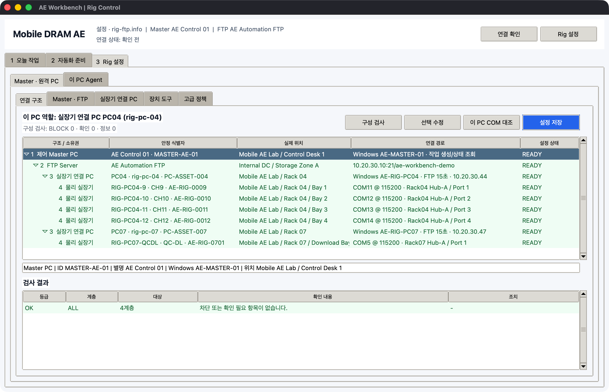

# PC · 실장기 · COM 연결 구조

실장기 제어에서 가장 중요한 규칙은 **제어 PC와 물리 실장기를 같은 대상으로 취급하지 않는 것**입니다.
AE Workbench는 다음 네 계층을 따로 저장하고 검사합니다.



```text
1 제어 Master PC
  └─ 2 FTP Server
       └─ 3 실장기 연결 PC / Slave Agent
            ├─ 4 물리 실장기 A ─ Console COM/HWID
            ├─ 4 물리 실장기 B ─ Console COM/HWID
            ├─ 4 물리 실장기 C ─ Console COM/HWID
            └─ 4 물리 실장기 D ─ Console COM/HWID
```

## 이름을 구별하는 기준

| 예 | 뜻 | 바뀔 수 있는가 |
| --- | --- | --- |
| `MASTER-AE-01` | 명령을 만든 Master PC ID | 장비 교체 전까지 유지 |
| `AE-MASTER-01` | Master의 Windows 컴퓨터 이름 | Windows 재설치 시 확인 |
| `PC04` | 사람이 보는 실장기 연결 PC 별명 | 변경 가능, PC마다 고유 |
| `rig-pc-04` | FTP job을 받는 Agent Node ID | 전송 주소이므로 고유·고정 |
| `PC-ASSET-004` | 회사 PC 자산 ID | 물리 PC를 따라감 |
| `CH11` | 그 PC 안에서 쓰는 논리 CH/이름 | 시험 구성에 따라 변경 가능 |
| `RIG-PC04-11` | 물리 실장기 자산 ID | PC나 CH를 옮겨도 유지 |
| `AE-RIG-0011` | 실장기 제조/관리 Serial | 물리 실장기를 따라감 |
| `COM13` | 현재 Windows가 부여한 Console port | USB 재연결 후 바뀔 수 있음 |
| `VID...\\AE-RIG-0011` | Console USB 장치 식별 문자열 | COM보다 안정적이어야 함 |
| `Rack04 Hub-A / Port 3` | 케이블·Hub의 물리 라벨 | 배선 변경 시 수정 |

`PC04`는 실장기가 아니고 `CH11`도 실장기 자산 ID가 아닙니다. 같은 실장기를 다른 PC로
옮기면 `fixture_id`와 `fixture_serial`은 유지하고 Node, CH, COM, 위치만 바꿉니다.

## 최초 구성 순서

1. `3 Rig 설정 > 연결 구조`에서 `Master · FTP` 행을 선택하고 `선택 수정`을 누릅니다.
2. Master ID·Windows 이름·실제 위치와 FTP 별명·실제 위치를 입력합니다.
3. `실장기 연결 PC` 탭에서 PC 별명, Node ID, 자산 ID, Windows 이름, IP, 랙 위치를 등록합니다.
4. PC를 선택하고 `실장기 관리`에서 물리 실장기 ID, Serial, 위치, CH, COM, HWID, Hub/Port를 입력합니다.
5. `연결 구조 > 구성 검사`에서 `BLOCK 0`인지 확인합니다.
6. 각 실장기 연결 PC에서 `이 PC COM 대조`를 실행합니다.
7. `설정 저장`, `서버 폴더 준비`, `Slave 설정 내보내기` 순서로 진행합니다.
8. 각 PC에서 `AEWorkbench.exe`와 내보낸 두 설정 파일을 함께 두고 Agent를 시작합니다.

검사 결과 행을 더블클릭하면 관련 Master/FTP/PC/실장기 행으로 이동합니다. 구성도 행을
더블클릭하거나 `선택 수정`을 누르면 해당 계층 편집창이 열립니다.

Master PC는 원격 `COM13`을 직접 열지 않습니다. Master는 FTP에 짧은 job을 쓰고, 해당
Node의 Agent가 자기 PC에 물리적으로 연결된 COM을 엽니다. 실시간 4채널 콘솔도 반드시
COM을 소유한 PC에서 실행합니다.

Windows에서 Agent가 시작될 때 설정 Node의 `windows_name`과 현재 컴퓨터 이름을 다시
비교합니다. 다른 PC용 설정 파일을 복사한 경우 FTP polling과 job 실행 전에 차단됩니다.
기존 설정에 Windows 이름이 없다면 호환 실행은 가능하지만 구성 검사에 확인 항목이 남습니다.

## 여러 PC를 CSV로 한 번에 등록

`실장기 연결 PC > 연결 PC 편집` 메뉴에서 다음 기능을 사용합니다.

| 메뉴 | 용도 |
| --- | --- |
| `CSV 템플릿 저장` | Excel에서 편집할 예제 헤더와 한 행 생성 |
| `현재 목록 CSV 내보내기` | 등록된 PC·실장기·COM 구성을 UTF-8 CSV로 저장 |
| `PC · 실장기 CSV 가져오기` | Node ID와 CH/이름 기준으로 현재 목록에 병합 |

CSV 한 행은 `실장기 연결 PC 1대 + 물리 실장기 1대`입니다. 같은 PC의 네 실장기는 같은
`node_id`로 네 행을 작성합니다. `CH9`, `CH10`, `QC-DL`, `Main`처럼 임의 이름을 사용할 수
있습니다. 파일에 없는 기존 PC·실장기와 기존 Binary/Test 상세값은 유지되며, 값을 비워서
삭제하는 작업은 GUI에서 수행합니다.

처음 확인할 핵심 열은 다음과 같습니다.

```text
node_id,pc_alias,pc_asset_id,windows_name,pc_ip,pc_location,
channel_id,fixture_id,fixture_serial,fixture_location,
com_port,baud_rate,console_identity,usb_location,soc_vendor,soc_model
```

## COM 대조 판정

`COM 대조`는 설정한 COM 번호만 찾지 않고 Windows가 보고한 description, HWID와 USB
location을 함께 비교합니다.

| 판정 | 의미 | 동작 |
| --- | --- | --- |
| `일치` | 설정 COM과 예상 HWID가 모두 일치 | 제어 가능 |
| `이동 제안` | 예상 HWID가 다른 COM에서 정확히 한 번 발견 | `안전한 COM 변경 적용` 가능 |
| `불명확` | 짧은 HWID가 여러 COM에 동시에 일치 | 자동 변경 금지, USB Serial까지 입력 |
| `불일치` | 설정 COM은 있으나 다른 하드웨어 | 제어 차단, 배선 확인 |
| `누락` | COM 또는 예상 하드웨어를 찾지 못함 | 제어 차단, 전원·케이블·드라이버 확인 |
| `미검증` | COM은 있으나 HWID를 입력하지 않음 | 자동 이동 금지, 구성 검사에 확인 항목 표시 |

`VID_0403&PID_6001`처럼 여러 어댑터가 공유하는 값만 입력하면 자동 이동에 사용할 수
없습니다. 가능하면 Device Manager 또는 COM 대조 화면에서 확인한 USB Serial이 포함된
문자열을 사용합니다.

수동 명령, 전원 제어와 직접 COM SEQ는 COM을 열기 직전에 다시 HWID를 검사합니다. USB
재열거로 설정이 오래됐으면 명령을 보내기 전에 중단됩니다.

## 구성 검사에서 막는 오류

다음 항목은 잘못된 PC나 실장기를 제어할 가능성이 있어 실행을 차단합니다.

- FTP 주소 또는 전용 root 누락
- 등록된 실장기 연결 PC 없음
- Node ID, PC 별명, PC 자산 ID, Windows 이름 또는 IP/Host 중복
- 같은 PC 안의 CH/이름 중복
- 물리 실장기 ID 또는 Serial 중복
- 같은 PC 안의 Console COM 중복 또는 COM 누락
- 여러 실장기가 같은 고정 ADB serial 사용

다음 항목은 구성을 저장할 수 있지만 `확인 필요`로 표시합니다.

- Master/FTP/PC/실장기 실제 위치 누락
- 실장기 ID 또는 Console HWID 누락
- 같은 HWID, USB 위치 또는 Download COM을 여러 실장기가 공유
- ADB 사용 상태인데 고정 ADB serial 누락
- 현재 Windows 이름과 Agent Node ID의 구성 불일치. Windows Agent 시작 시에는 실행 차단

Windows UI 매크로나 화면 캡처처럼 COM을 사용하지 않는 작업은 대상 PC와 FTP 구조만
검사합니다. 직접 COM SEQ, 전원, 통신 점검, Binary 작업은 대상 PC의 실장기/COM 오류까지
검사합니다. 긴급 중단은 구성 오류가 있어도 항상 보낼 수 있습니다.

## 현장 변경별 처리

| 상황 | 수정할 값 | 반드시 할 확인 |
| --- | --- | --- |
| PC 재부팅 | 보통 없음 | Agent heartbeat와 COM 대조 |
| USB를 뺐다가 연결 | COM이 바뀌면 `com_port` | HWID 일치 후 안전 변경 적용 |
| 실장기를 다른 Bay로 이동 | 실장기 위치, USB 위치 | fixture ID/Serial은 유지 |
| 실장기를 다른 PC로 이동 | 대상 Node, CH, COM, 위치 | 이전 PC 항목 제거 후 양쪽 COM 대조 |
| 연결 PC 본체 교체 | PC 자산 ID, Windows 이름, IP | Node 중복 없이 Agent 파일 재배포 |
| CH9~CH12가 아닌 이름 사용 | `channel_id` 또는 `name` | 같은 PC 안에서만 고유하면 됨 |
| CH가 없는 단일 프로그램 | `name=Main` | `channel_id`는 비워도 됨 |
| 여러 Master가 명령 제출 | 각 Master ID·Windows 이름 | 모니터의 `요청 Master`와 결과 origin 확인 |
| FTP 일시 단절 | 설정 변경 없음 | Agent 재연결 상태와 마지막 신호 시간 확인 |
| COM을 SK Commander가 점유 | 프로그램 한쪽 연결 해제 | 한 COM을 두 프로그램이 동시에 열지 않음 |

## 모니터링에서 보이는 소유권

`PC 상태`는 PC 별명/자산 ID, Node, 실제 위치, 현재 job, 요청 Master와 마지막 신호를
표시합니다. `CH / 자재 / Binary`는 물리 실장기 ID와 위치를 먼저 표시한 뒤 CH/Slot,
COM/baud, SoC, 자재, Test/SEQ/Grid를 보여줍니다.

Excel 내보내기에는 화면보다 더 많은 다음 근거가 포함됩니다.

- Master ID·별명·Windows 이름·실제 위치
- PC Node·별명·자산 ID·Windows 이름·IP·실제 위치
- 실장기 ID·Model·Serial·실제 위치
- CH/Slot·Console COM/baud·HWID·USB 위치·ADB serial
- Binary provenance·자재·Test/SEQ·Grid·판정

## 운영 전 체크리스트

- [ ] 연결 구조가 `BLOCK 0`이다.
- [ ] 대상 PC의 Node ID와 Windows 이름이 실제 PC와 일치한다.
- [ ] 네 실장기의 자산 ID와 Serial이 실제 라벨과 일치한다.
- [ ] COM 대조가 모두 `일치`이거나 확인된 `이동 제안`만 적용했다.
- [ ] HWID에 동일 제품 공통 VID/PID뿐 아니라 장치별 식별 근거가 있다.
- [ ] SK Commander/QTTY/PuTTY가 실행할 COM을 점유하지 않는다.
- [ ] 같은 Node의 Agent EXE가 이 PC에서 하나만 실행 중이다.
- [ ] 직접 COM 시험은 한 CH dry-run 후 최대 4개로 확대한다.
- [ ] Binary 작업은 대상 한 CH, Vendor/SoC, XML SHA-256과 물리 조건을 다시 확인한다.

실제 Windows 11 장치 드라이버, USB Hub, SK Commander와 Vendor Downloader는 CI에서
재현되지 않습니다. 최종 승인은 로그인된 현장 PC에서 COM 대조와 한 CH dry-run으로
수행합니다.
