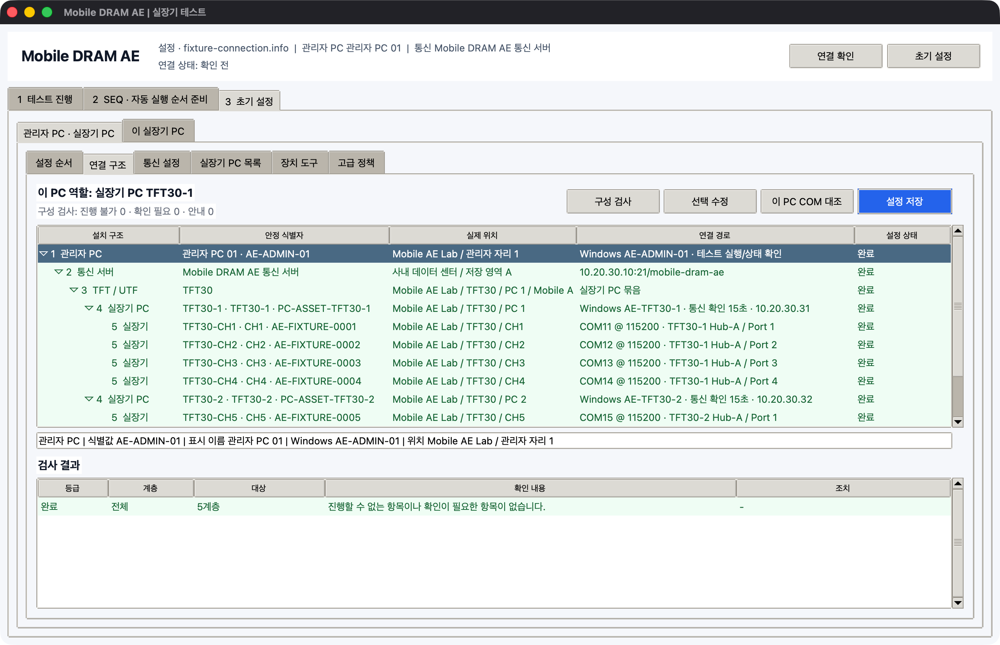

# 초기 설정

이 설명서는 Mobile DRAM 테스트를 준비하고 운용하는 작업자를 위한 문서입니다. 화면과 설명서에서는 다음 용어만 사용합니다.

| 용어 | 뜻 | 예 |
|---|---|---|
| 관리자 PC | 여러 실장기 PC에 테스트를 보내고 상태를 확인하는 PC | AE-ADMIN-01 |
| 통신 서버 | 관리자 PC와 실장기 PC가 요청과 결과를 주고받는 서버 폴더 | `/mobile-dram-ae` |
| TFT/UTF | 실장기 PC가 설치된 큰 단위 | TFT30 |
| 실장기 PC | 실장기 최대 4대가 연결된 Windows PC | TFT30-1 |
| 실장기 번호 | 실제 실장기 한 대를 나타내는 번호 | CH1 |

## 프로그램 설치 파일

1. 관리자 PC에 최신 Windows 배포본의 `AEWorkbench.exe`를 다운로드합니다.
2. 실행 파일을 쓰기 가능한 전용 폴더에 둡니다.
3. 관리자 PC에서는 이 실행 파일 하나로 초기 설정과 테스트 운용을 진행합니다.
4. 실장기 PC용 파일은 초기 설정의 `시작 폴더 만들기`에서 PC별로 생성합니다.

별도의 이전 압축 파일이나 PC 역할별 실행 파일을 직접 조합하지 않습니다. 관리자 PC와 실장기 PC는 같은 `AEWorkbench.exe`를 사용하며, 함께 놓인 `fixture-connection.info`의 PC 정보로 역할을 구별합니다.

## 설치 구조

```text
관리자 PC
  └─ 통신 서버
      └─ TFT30
          ├─ TFT30-1 ─ CH1, CH2, CH3, CH4
          ├─ TFT30-2 ─ CH5, CH6, CH7, CH8
          ├─ TFT30-3 ─ CH9, CH10, CH11, CH12
          └─ TFT30-4 ─ CH13, CH14, CH15, CH16
```

`CH1` 같은 번호는 실제 실장기 한 대를 식별합니다. 실장기 PC 한 대에는 실장기를 최대 4대까지 등록합니다.

| 실제 현장 단위 | 프로그램에서 확인할 위치 |
|---|---|
| TFT30, TFT31, UTF10 | `3 초기 설정 > 연결 구조`의 TFT/UTF 행 |
| TFT30-1부터 TFT30-4 | `실장기 PC 목록`과 `실장기 상태` |
| CH1부터 CH16 | 각 실장기 PC의 `실장기 관리` |
| SK Commander 창 최대 4개 | 각 실장기의 `SK Commander 항목 연결` |



## 실장기 정보 입력 기준

실장기 정보는 작업자 입력값과 SK Commander 확인값으로 구분합니다. 초기 설정 시 아래 기준에 따라 입력합니다.

| 정보 | 입력 또는 확인 방법 |
|---|---|
| SoC | 작업자가 직접 입력하고, SK Commander의 SoC 항목을 연결한 후 화면 값으로 확인 |
| Binary | 작업자가 직접 입력. 이름·버전·원본 폴더와 수정 시각을 함께 저장 |
| DRAM 종류 / Part, Lot | 장착한 자재 정보를 작업자가 직접 입력 |
| 장착 자재 ID | `AA-1`, `SS-2`, `AS1S1-1`처럼 실장기마다 직접 입력하고 SK Commander 항목으로 확인 |
| 테스트 이름·상태 | 테스트 중 SK Commander의 텍스트 또는 색상으로 확인 |
| 부팅 단계 | SK Commander의 BL1, BL2, LK, OS 표시로 확인 |
| 고장 상태 | 작업자가 `정상`, `사용 주의`, `사용 불가`, `수리 중`, `미확인` 중 선택 |

Binary를 확인하지 못한 상태에서도 설정을 저장할 수 있습니다. Binary를 입력하기 전까지 초기 설정 화면에는 `확인 필요`가 표시됩니다. Lot이 비어 있는 경우에도 기본 정보는 미완료 상태로 표시됩니다. Binary 정보는 작업자가 확인한 값을 입력합니다.

## 초기 설정 절차

1. 관리자 PC에서 `AEWorkbench.exe`를 실행합니다.
2. `3 초기 설정 > 관리자 PC · 실장기 PC > 설정 순서`를 엽니다.
3. 화면의 1번부터 6번까지 위에서 아래로 진행합니다.
4. `연결 구조`에서 관리자 PC, 통신 서버, TFT/UTF, 실장기 PC, 실장기 순서가 맞는지 검사합니다.
5. 각 실장기의 SoC, Binary, DRAM, Lot, 장착 자재 ID, 고장 상태를 입력합니다.
6. 각 실장기에 대해 `SK Commander 항목 연결`을 진행합니다.
7. `통신 폴더 준비`를 누릅니다.
8. `시작 폴더 만들기`로 PC별 시작 폴더를 만듭니다.
9. 각 실장기 PC에서 해당 폴더의 `AEWorkbench.exe`를 실행하고 `통신 시작`을 누릅니다.
10. 관리자 PC에서 `1 테스트 진행 > 실장기 상태 > 새로고침`을 눌러 모두 표시되는지 확인합니다.


## 실장기 PC 설치 파일

`시작 폴더 만들기`를 누르면 선택한 PC마다 이름이 분명한 폴더가 생깁니다. 별도의 압축 파일을 직접 만들거나 JSON을 손으로 편집할 필요가 없습니다.

| 파일 | 용도 |
|---|---|
| `AEWorkbench.exe` | 실행 프로그램 |
| `fixture-connection.info` | 통신 서버와 해당 실장기 PC 설정 |
| `fixture-device.config.json` | COM, Baud rate, Binary 도구 설정 |
| `README-SETUP.txt` | 해당 PC에서 바로 따라 할 시작 안내 |

Windows 배포본에서 실행한 경우에만 실행 파일까지 함께 복사됩니다. 개발 환경에서 내보낸 폴더에는 설정 파일만 들어갑니다.

## 관련 문서

- [관리자 PC 설정](setup/admin-pc.md)
- [실장기 PC 설정](setup/fixture-pc.md)
- [SK Commander 항목 연결](setup/sk-commander.md)
