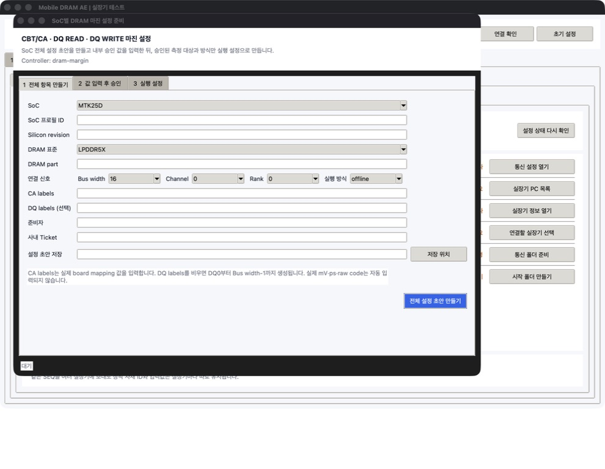

# SoC별 DRAM 마진 설정

이 기능은 `SM8850`, `MTK24D`, `MTK25D` 실장기의 CBT/CA, DQ READ, DQ WRITE 마진을
준비할 때 사용합니다. 각 측정은 Vref `mV`와 Timing `ps`를 분리해서 기록하며 1D 또는 2D
측정 방식으로 실행합니다.

## 시작 위치

1. `1 테스트 진행`을 엽니다.
2. `운영 도구 열기`를 누릅니다.
3. `마진 번들 만들기`를 누릅니다.
4. `Margin Controller` 실행 파일을 선택합니다.
5. `SoC 마진 설정`을 누릅니다.

화면은 `1 전체 항목 만들기`, `2 값 입력 후 승인`, `3 실행 설정` 세 단계로 구성됩니다.

## 1. 전체 항목 만들기

| 입력값 | 입력 방법 |
|---|---|
| SoC | `SM8850`, `MTK24D`, `MTK25D` 중 실제 실장기 값 |
| SoC 프로필 ID | SoC, DRAM part, revision, FSP를 구별하는 사내 식별값 |
| Silicon revision | 실제 장치와 내부 PHY 문서의 revision |
| DRAM 표준 | 실제 조합에 맞는 `LPDDR4`, `LPDDR4X`, `LPDDR5`, `LPDDR5X` |
| DRAM part | 실장기에 장착된 정확한 part number |
| Bus width | 실제 연결 폭 8, 16, 32, 64 중 하나 |
| CA labels | Board mapping 문서의 물리 CA 이름을 쉼표로 구분 |
| DQ labels | 특별한 이름이 있을 때만 입력. 비우면 `DQ0`부터 자동 생성 |
| 실행 방식 | 기본값 `offline`. 승인된 live OS 제어 서비스가 있을 때만 `live-os` |
| 준비자·사내 Ticket | 값을 준비한 사람과 추적 가능한 작업 번호 |

`전체 설정 초안 만들기`를 누르면 다음 항목이 모두 들어간 JSON 초안이 생성됩니다.

- 모든 CA의 CBT Timing 1D, CBT Vref 1D, CBT 2D eye
- 모든 DQ의 READ Timing 1D, READ Vref 1D, READ 2D eye
- 모든 DQ의 WRITE Timing 1D, WRITE Vref 1D, WRITE 2D eye

SoC 이름만 보고 register 주소, Vref raw code, delay tap을 추정하지 않습니다. 따라서 초안의 실제
물리값은 비어 있는 것이 정상입니다.

## 2. 값 입력 후 승인

초안 JSON에 내부 승인 문서의 값을 입력합니다.

1. Data rate, FSP, 온도, 관련 rail `mV`
2. SoC PHY 명세, DRAM part data sheet, 물리 DQ mapping 문서
3. 적용한 JEDEC revision, 전원 명세, 마진 합격 기준 문서
4. 각 항목의 control scope와 private control symbol
5. Legal range, nominal `mV` 또는 `ps`, nominal raw code
6. Linear 식 또는 raw-code lookup table
7. Sweep 범위와 최소 좌·우·상·하 합격 마진

값 입력을 마친 뒤 `다시 읽기`를 누릅니다. 화면에 표시된 SHA-256을 검토자가 직접 확인해
`SHA 직접 확인 입력`에 적습니다. 준비자와 다른 승인자 이름을 입력하고 `승인 명세 만들기`를
누릅니다.

값이 빠졌거나 범위·단위·raw code 환산이 맞지 않으면 승인 파일이 생성되지 않습니다.

## 3. 실행 설정 만들기

승인된 SoC 설정을 선택하면 승인된 측정 대상과 방식만 목록에 표시됩니다.

| 화면 표시 | 의미 |
|---|---|
| `ca:CA0` | 해당 CA 신호의 CBT/CA 마진 |
| `dq:DQ3` + `read-eye` | DQ3의 DRAM TX → SoC RX Timing/Vref 2D 마진 |
| `dq:DQ3` + `write-eye` | DQ3의 SoC TX → DRAM RX Timing/Vref 2D 마진 |
| `*-timing-1d` | Timing `ps` 한 축만 측정 |
| `*-vref-1d` | Vref `mV` 한 축만 측정 |

`Target ID`, `실장기 ID`, `Device ID`에는 실제 장치를 다시 식별할 수 있는 고정값을 입력합니다.
승인 명세와 같은 SoC용으로 빌드한 `마진 실행 파일`을 선택합니다.

검토용 실행 설정은 `실제 PHY 변경 허용`을 끈 상태로 만들 수 있습니다. 실제 측정에 사용할 때는
이 항목을 켜고 화면의 승인 명세 SHA-256을 직접 입력해야 합니다. 생성된 실행 설정은 앞 화면의
Plan 입력란에 자동 반영됩니다.

## 4. 번들 만들기와 실행

1. 실행 설정에 맞는 PHY 기준 파일을 `PHY 기준 준비 · 승인`에서 만듭니다.
2. 실행 설정과 승인 PHY 기준이 선택됐는지 확인합니다.
3. `만들기`를 눌러 `.drammargin.zip`을 생성합니다.
4. 테스트 대상 실장기 PC 하나를 선택해 파일을 전달합니다.
5. 결과의 전체 point CSV, DQ margin CSV, 2D 그래프와 실제 적용 `mV`/`ps`를 확인합니다.

승인된 SoC 명세와 다른 SoC, DRAM part, FSP, 물리 DQ mapping 또는 실행 파일은 시작 전에
거부됩니다.
