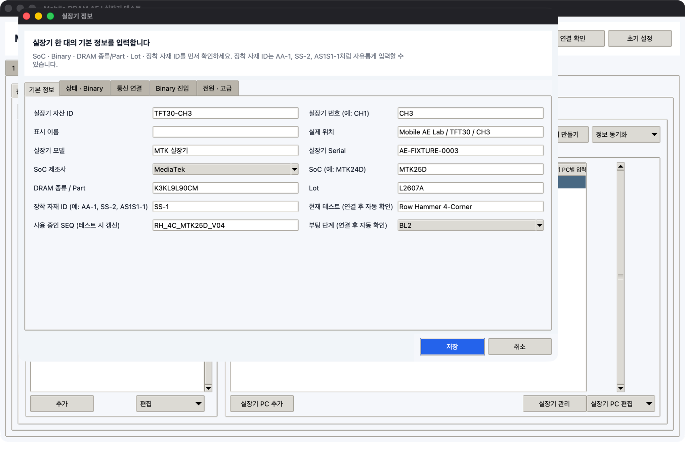

# 실장기 정보 수정과 Excel

## 관리하는 기본 정보

각 실장기에는 다음 정보가 항상 한 묶음으로 표시됩니다.

- SoC
- Binary 이름, 버전, 원본 폴더
- DRAM 종류 / Part, Lot, 장착 자재 ID
- 현재 테스트와 SEQ
- 테스트 상태
- 부팅 단계 BL1, BL2, LK, OS
- Grid 진행 수
- 고장 상태
- 마지막 수정 시각, 수정자, 수정 위치

## 정보별 입력 기준

| 구분 | 값 |
|---|---|
| SK Commander에서 확인 | SoC, 장착 자재 ID, 현재 테스트, 테스트 상태, 부팅 단계 |
| 작업자가 직접 입력 | Binary 이름·버전·원본 폴더, DRAM 종류/Part, Lot, 고장 상태, 메모 |

Binary 정보는 실제 Binary를 적용하거나 확인한 작업자가 입력합니다. 프로그램은 수정자, 수정 PC와 수정 시각을 기록합니다.

## Binary 수정

1. `3 초기 설정 > 실장기 PC 목록`을 엽니다.
2. 실장기 PC를 선택하고 `실장기 관리`를 누릅니다.
3. 실장기를 선택하고 `수정`을 누릅니다.
4. `상태 · Binary` 탭에서 이름, 버전, 원본 폴더를 입력합니다.
5. `저장`을 누릅니다.

Binary 관련 값이 바뀌면 `Binary 수정 시각`, `Binary 수정자`, `Binary 수정 위치`가 자동으로 기록됩니다.

## 관리자 PC·실장기 PC 정보 동기화

- 관리자 PC에서 수정하고 초기 설정 화면의 `저장`을 누르면 통신 서버에 반영됩니다.
- 실장기 PC에서는 수정 후 `정보 동기화 > 이 PC 정보를 통신 서버에 반영`을 누릅니다.
- 반대쪽 PC에서는 `정보 동기화 > 통신 서버의 최신 정보 받기`를 누릅니다.
- 두 곳에서 같은 실장기를 수정했다면 수정 시각이 더 최근인 정보가 유지됩니다.
- PC 시간이 크게 다르면 잘못된 값이 최신으로 판단될 수 있으므로 Windows 시간을 맞춥니다.

SoC, 자재, 테스트 상태, 부팅 단계는 SK Commander 규칙으로 읽은 값과 합쳐집니다. Binary는 사람이 입력한 최신 값을 유지합니다.

## 고장 상태 기록

| 값 | 사용 기준 |
|---|---|
| 정상 | 제한 없이 사용 가능 |
| 사용 주의 | 특정 조건에서만 사용 가능 |
| 사용 불가 | 테스트 대상에서 제외 |
| 수리 중 | 수리 또는 점검 진행 중 |
| 미확인 | 아직 상태 확인 전 |

고장 상태를 바꿀 때는 메모에 증상과 확인 날짜를 함께 적습니다.

## Excel 내보내기

1. `1 테스트 진행 > 실장기 상태`를 엽니다.
2. `새로고침`을 눌러 최신 상태를 읽습니다.
3. `더보기 > Excel 내보내기`를 누릅니다.
4. 저장할 `.xlsx` 파일을 선택합니다.

Excel에는 실장기 PC 상태, 실장기별 SoC/Binary/자재/테스트/부팅 단계/고장 상태, 최근 결과가 함께 들어갑니다.
