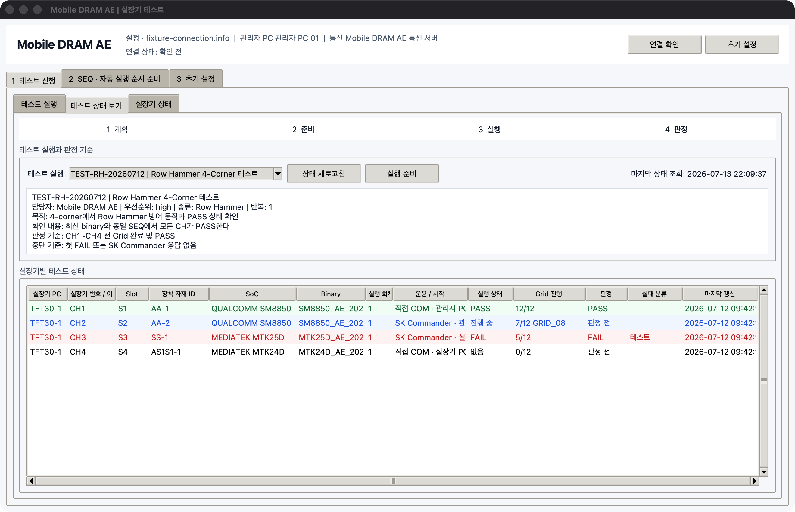

# 테스트 진행 절차

초기 설정 완료 후 SEQ 준비, 테스트 실행, 결과 확인 순서로 진행합니다.

## 전체 절차

  
<strong>1. 실장기 확인</strong>SoC, Binary, DRAM, Lot, 장착 자재 ID와 고장 상태를 확인합니다.

  
<strong>2. SEQ 준비</strong>SEQ를 열고 문법, Grid, 명령 순서와 파일 이름을 검사합니다.

  
<strong>3. 자동 실행 순서 준비</strong>SK Commander의 Load, 입력, Start 동작을 녹화하고 실장기별 입력값을 지정합니다.

  
<strong>4. 실행 전 점검</strong>선택한 실장기, SEQ, 입력값, SK Commander 인식 상태를 확인합니다.

  
<strong>5. 테스트 시작</strong>같은 SEQ를 여러 실장기에 보내되 장착 자재 ID는 각 실장기 값을 사용합니다.

  
<strong>6. 상태 확인</strong>진행 중에만 상태를 확인하고 PASS, FAIL, 중지와 Grid 진행 수를 봅니다.

## 1. 실장기 기본 정보 확인

`1 테스트 진행 > 실장기 상태`에서 사용할 실장기를 먼저 확인합니다.

| 확인 항목 | 확인할 내용 |
|---|---|
| 실장기 PC와 실장기 번호 | 예: `TFT30-1 / CH1` |
| SoC | 예: `MTK24D`, `MTK25D`, `SM8850` |
| Binary | 현재 올린 이름, 버전, 원본 폴더, 수정 시각 |
| 장착 자재 | DRAM 종류 / Part, Lot, `AA-1` 같은 장착 자재 ID |
| 고장 상태 | 정상 또는 사용 제한 여부 |
| SK Commander | 실장기 번호, SoC, 자재, 테스트 상태, 부팅 단계 연결 여부 |

고장 상태가 `사용 불가` 또는 `수리 중`인 실장기는 실행 대상에서 제외합니다. Binary가 비어 있거나 수정 시각이 오래되었다면 실제 값을 확인한 뒤 수정합니다.

## 2. SEQ 작성과 검사

1. `2 SEQ · 자동 실행 순서 > SEQ 편집`을 누릅니다.
2. 기존 SEQ를 열거나 새 SEQ를 작성합니다.
3. Grid를 나타내는 `#이름`과 그 안에서 실행할 명령 순서를 확인합니다.
4. `검사 · 패키지 준비`를 누릅니다.
5. 검사 결과가 `PASS`인지 확인합니다.

검사는 다음 항목을 확인합니다.

- `;` 뒤에 불필요한 공백이 없는지
- Grid 이름과 명령이 비어 있지 않은지
- 부팅 단계 이동을 위한 `exit` 횟수와 명령 순서가 맞는지
- 필요한 clock, 온도, VDD 명령이 빠지지 않았는지
- 파일 이름이 해당 테스트의 이름 규칙에 맞는지

검사를 통과하지 않은 SEQ는 통신 서버에 등록할 수 없습니다. 현장 규칙이 프로그램 기본 검사보다 구체적인 경우에는 사내 승인 예시와 함께 최종 확인합니다.

## 3. 자동 실행 순서 준비

1. `자동 실행 순서 편집`을 엽니다.
2. `연속 녹화 시작`을 누릅니다.
3. SK Commander에서 SEQ Load, 자재 입력, Start 순서로 조작합니다.
4. 다시 편집 화면으로 돌아와 `녹화 정지`를 누릅니다.
5. 녹화 타임라인에서 클릭한 프로그램·창·항목과 입력값을 확인합니다.
6. 실장기마다 달라지는 입력은 `선택 입력을 실장기별 값으로` 바꿉니다.
7. 동작 이름, 순서, 반복과 조건을 정리한 뒤 각 블록을 한 번씩 시험합니다.

자세한 내용은 [녹화와 동작 블록 편집](automation-recording.md)을 참고합니다.

## 4. 실행표 만들기

`1 테스트 진행 > 테스트 실행`에서 실행표를 만듭니다.

1. `자동화 새로고침`을 눌러 등록한 SEQ와 자동 실행 순서를 불러옵니다.
2. 실행할 테스트 이름을 입력합니다.
3. 사용할 SEQ와 자동 실행 순서를 선택합니다.
4. `실장기 불러오기`로 대상 행을 만듭니다.
5. 실행할 실장기만 선택합니다.
6. 각 행의 SoC, Binary, 장착 자재 ID와 입력값을 확인합니다.
7. SK Commander를 조작할지, 직접 COM으로 실행할지 실행 방식을 확인합니다.

### 실장기별 자재 ID 적용

다음처럼 같은 SEQ를 사용해도 장착 자재 ID는 실장기마다 다르게 유지됩니다.

| 대상 | SEQ | `material_id` |
|---|---|---|
| TFT30-1 / CH1 | `RH_4C_SM8850_V04` | `AA-1` |
| TFT30-1 / CH2 | `RH_4C_SM8850_V04` | `AA-2` |
| TFT31-2 / CH7 | `RH_4C_SM8850_V04` | `AS1S1-1` |

자동 실행 순서의 입력 블록에 `${material_id}`를 사용하면 실행 시 각 실장기 정보의 값으로 바뀝니다. 실행표에서 값을 수정하면 그 실행에만 적용할 수도 있습니다.

## 5. 실행 전 점검과 시작

`실행 시작`을 누르기 전에 다음을 확인합니다.

- 선택한 실장기 PC가 최근 상태를 보냈는지
- 대상 SK Commander 창이 열려 있고 실장기 번호가 맞는지
- SEQ와 자동 실행 순서가 최신 검사본인지
- 실장기별 필수 입력값이 비어 있지 않은지
- 같은 COM을 SK Commander와 직접 제어 화면에서 동시에 사용하지 않는지
- 사용 불가 또는 수리 중인 실장기가 포함되지 않았는지

모든 항목을 통과한 뒤 `실행 시작`을 누릅니다. 실장기 PC별 요청은 서로 분리되므로 일부 PC가 늦어도 다른 PC의 요청이 사라지지 않습니다.

## 6. 테스트 중 상태 확인

1. `테스트 상태`에서 `새로고침`을 누릅니다.
2. 연속 확인이 필요한 동안만 `모니터링 시작`을 누릅니다.
3. 실장기별 상태와 Grid 진행 수를 확인합니다.
4. FAIL 또는 중지가 발생하면 해당 행의 결과와 최근 로그를 먼저 봅니다.
5. 화면 확인이 필요할 때만 대상 PC를 선택하고 `전체 화면 보기`를 요청합니다.

| 표시 | 뜻 | 작업자가 할 일 |
|---|---|---|
| 없음 | 실행 중인 테스트가 없음 | 시작 전 상태인지 확인 |
| 진행 중 | 테스트 실행 중 | Grid 진행과 최근 갱신 시각 확인 |
| PASS | 설정한 완료 조건 통과 | 결과와 로그 저장 여부 확인 |
| FAIL | 실패 조건 감지 | Grid, 부팅 단계, 최근 로그 확인 |
| 중지 | 정상 완료 전에 멈춤 | 중단 사유와 COM·프로그램 상태 확인 |

진행 중인 테스트가 없으면 연속 모니터링은 자동으로 끝납니다. 계속 켜 두는 용도로 사용하지 않습니다.

## 7. 종료 후 정리

1. 모든 실장기의 최종 상태를 새로고침합니다.
2. 필요하면 `Excel 내보내기`로 상태표를 저장합니다.
3. Binary 또는 장착 자재를 바꿨다면 실장기 정보를 수정합니다.
4. 다음 테스트 전에 FAIL, 중지, 고장 상태가 남은 실장기를 확인합니다.
