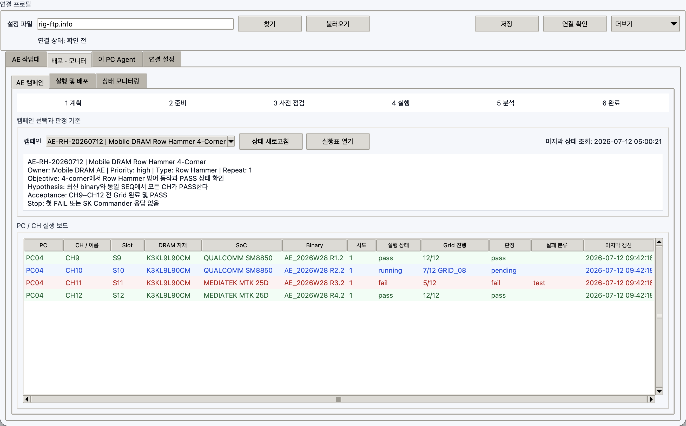

# AE 캠페인 운영

`AE 캠페인`은 여러 PC와 CH에 흩어진 실행을 하나의 시험 목적과 판정 기준으로 보는
Master 화면입니다. `.rigseq.zip`에 캠페인이 포함된 경우에만 목록에 나타납니다.



## 준비 흐름

```text
Seq Generator Campaign
  -> AE preflight READY
  -> checksummed .rigseq.zip
  -> Rig Master upload
  -> PC x CH x attempt 실행표
  -> Slave hash/attempt validation
  -> SK Commander launcher
  -> monitor verdict + Grid progress
  -> result triage
```

## 캠페인 확인

1. `모니터 및 실행 > 실행 및 배포`에서 `.rigseq.zip`을 업로드합니다.
2. `AE 캠페인`으로 이동합니다.
3. Campaign ID, 제목, owner, priority, test type, repeat를 확인합니다.
4. Objective, Hypothesis, Acceptance, Stop 조건을 확인합니다.

Rig는 다음이 맞지 않으면 업로드 또는 Slave 실행을 거부합니다.

- campaign bundle, snapshot, preflight schema
- snapshot과 preflight의 Campaign ID
- `preflight.ok=true`
- canonical campaign snapshot SHA-256
- 실행 행의 attempt가 `1..repeat_count` 범위인지

기존 campaign 없는 Rig SEQ는 계속 사용할 수 있지만 캠페인 보드와 readiness 보장은 없습니다.

## 실행표 만들기

1. 캠페인 화면에서 `실행표 열기`를 누릅니다.
2. 해당 `[SEQ]` 패키지를 선택합니다.
3. SK Commander launcher `[FLOW]`를 선택합니다.
4. `설정 PC 불러오기`를 누릅니다.
5. 생성된 모든 행의 PC, CH/이름, Slot, 자재, Binary, attempt를 확인합니다.
6. `실행표 전송`을 누릅니다.

repeat가 2이고 한 PC에 CH9~CH12 네 개가 있으면 8행이 생성됩니다. 같은 Windows PC의
UI 자동화는 포커스 충돌을 막기 위해 Slave가 순서대로 실행합니다.

Campaign ID와 제목은 package snapshot 값이 우선합니다. 실행표에서 이 값을 임의로
바꾸더라도 Master와 Slave가 package 값을 다시 적용합니다. `campaign_attempt`만 계획된
범위 안에서 행별로 바꿀 수 있습니다.

## 캠페인 보드 읽기

| 열 | 의미 |
| --- | --- |
| PC, CH/이름, Slot | 실행 대상 |
| DRAM 자재, SoC, Binary | 현재 target provenance |
| 시도 | 현재 또는 계획된 repeat 번호 |
| 실행 상태 | planned, running, pass, fail, offline |
| Grid 진행 | 완료/전체와 현재 Grid |
| 판정 | pending, pass, fail |
| 실패 분류 | 자동 또는 monitor 기반 분류 |

`상태 새로고침`은 기존 heartbeat 파일을 읽습니다. 실시간 socket 연결이나 영상
streaming이 아니며, 새 screenshot도 요청하지 않습니다.

물리 CH inventory와 반복 실행 이력은 분리됩니다. Slave heartbeat는 최근 campaign run을
PC당 최대 256개만 유지해 attempt 2가 시작되어도 attempt 1 판정이 보드에서 사라지지
않게 하면서 상태 파일이 무한히 커지는 것을 막습니다. 영구 원본은 `results`와 `triage`입니다.

## Monitor에서 최종 판정 만들기

Picker에서 SK Commander 상태 component를 다음처럼 구성합니다.

- 파랑/running: 실행 중, acceptance는 pending
- 초록/PASS: acceptance pass
- 빨강/FAIL: acceptance fail, failure class test
- Grid text: block 이름이나 상태에 `GRID` 또는 `PROGRESS` 표시

여러 조건은 Picker의 AND/OR group으로 묶습니다. 예를 들어 창 안의 CH11 marker와
PASS text 또는 초록 상태를 함께 확인할 수 있습니다.

## 실패 분류와 조치

1. `상태 모니터링`에서 대상 PC의 `결과 새로고침`을 누릅니다.
2. 실패 행을 선택합니다.
3. `더보기 > 선택 결과 분류`를 누릅니다.
4. 분류, 조치, 담당자, 판정 근거와 다음 작업을 입력합니다.

분류:

```text
test | setup | automation | infrastructure | material | product
stopped | timeout | unknown
```

조치:

```text
open | retest | blocked | accepted | closed
```

이 기록은 `triage/<node>/<job_id>.json`에 저장됩니다. `results` 원본과 로그를 수정하지
않으며, 사용자가 저장할 때 한 번만 FTP에 씁니다.

## 현장 검증 경계

Rig가 검증하는 것은 package 구조, hash, 계획값, launcher 형식, 실행/monitor 결과입니다.
실제 SK Commander prompt와 Grid component, Qualcomm/MTK downloader, 물리 switch,
온도/VDD 계측 정확도는 현장 성공 자료와 대조해야 합니다.
