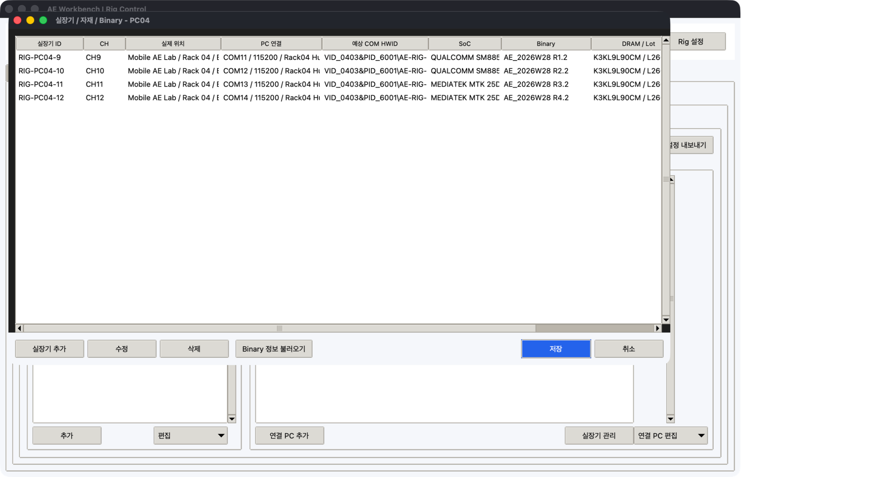

# Master 세팅

Master 설정은 Rig를 처음 구성하거나 PC/CH가 바뀔 때만 사용합니다. 일일 시험은
`1 오늘 작업`에서 수행합니다.

## 1. FTP 연결

`3 Rig 설정 > Master · 원격 PC > Master · FTP`를 엽니다. `연결 구조`의 Master/FTP 행에서
`선택 수정`을 누르면 Master ID·Windows 이름·실제 위치와 FTP 별명·위치를 함께 입력할 수
있습니다.

| 필드 | 예시 | 설명 |
| --- | --- | --- |
| 설정 파일 | `rig-ftp.info` | Master와 실행표 저장 파일 |
| FTP 주소·포트 | `192.168.0.10`, `21` | 사내 FTP endpoint |
| 아이디 | `macro_user` | 전용 계정 권장 |
| 비밀번호 환경 변수 | `RIG_FTP_PASSWORD` | 평문 비밀번호 대신 사용 |
| 서버 폴더 | `/win_automation_macros` | Rig 전용 spool root |
| FTPS / Passive | 사내 서버 정책 | 다른 서비스와 동일한 정책 사용 |
| 로컬 시험 폴더 | 비움 | FTP 대신 로컬 backend를 시험할 때만 사용 |

`연결 확인`은 전용 root 아래 임시 파일을 쓰고 다시 읽은 뒤 삭제합니다. 성공한 다음
설정 파일 영역의 `저장`을 누릅니다.

## 2. 연결 구조 검사

`연결 구조`는 Master → FTP → 실장기 연결 PC → 물리 실장기를 한 화면에서 보여줍니다.
`구성 검사`가 `BLOCK 0`인지 확인합니다. 행을 선택하면 전체 Windows 이름, Serial, COM
HWID와 Hub 위치가 표 아래에 표시됩니다. 상세 기준은
[PC · 실장기 · COM 연결 구조](../fixture-topology.md)를 따릅니다.

## 3. 공통 변수와 실장기 연결 PC

`실장기 연결 PC`에서 다음 순서로 등록합니다.

1. 공통 변수에는 `line`, `operator`처럼 전체 PC가 공유하는 기본값을 추가합니다.
2. `연결 PC 추가`에서 별명, Node ID, 자산 ID, Windows 이름, IP, 실제 위치와 PC별 값을 입력합니다.
3. PC를 선택하고 `실장기 관리`를 누릅니다.
4. 물리 실장기 ID/Serial/위치와 CH/이름, Slot, COM/HWID, SoC, Binary, DRAM 자재, Test/SEQ를 입력합니다.
5. PC 수정·삭제와 CSV 일괄 관리는 `연결 PC 편집` 메뉴를 사용합니다.

별명은 `PC04`, Node ID는 `rig-pc-04`처럼 PC마다 고유하게 정합니다. CH는 연속 숫자가
아니어도 되며 `CH9`, `CH11`, `QC-DL`, `Main`을 함께 사용할 수 있습니다.

Test Sequence Generator의 `.rigbinary.json`이 있으면 `실장기 관리 > Binary 정보 불러오기`로
SoC, XML, version, 원본 폴더와 수정 시각을 적용할 수 있습니다.

PC가 많으면 `연결 PC 편집 > CSV 템플릿 저장` 후 Excel에서 한 행당 실장기 한 대를
작성하고 `PC · 실장기 CSV 가져오기`를 사용합니다. 가져오기는 Node ID와 CH를 기준으로
병합하며 파일에 없는 기존 항목은 유지합니다.

## 4. 서버 폴더와 Slave 설정

1. `서버 대상`에는 등록한 별명 또는 Node ID가 자동으로 표시됩니다.
2. `서버 폴더 준비`를 눌러 전용 spool 하위 폴더를 만듭니다.
3. `Slave 설정 내보내기`를 누르고 출력 폴더를 선택합니다.
4. 생성된 PC별 폴더의 `rig-ftp.info`를 해당 원격 PC에 배치합니다.

Master가 지정한 root 밖의 다른 FTP 폴더는 만들거나 정리하지 않습니다.

## 5. 고급 정책

`고급 정책`에는 일상적으로 바꾸지 않는 값만 있습니다.

| 필드 | 기본값 | 의미 |
| --- | ---: | --- |
| 조회 간격 | 5초 | Agent polling 간격 |
| 조회 분산 | 3초 | 여러 PC 동시 접속 분산 |
| 화면 요청 최소 | 30초 | screenshot 연속 요청 제한 |
| 결과/로그 보관 | 200 | Node별 최근 파일 수 |
| 작업 보관 | 500 | 처리된 job archive 수 |
| 화면 보관 | 20 | Node별 screenshot 수 |

외부 Python은 일반 Python script를 실행할 때만 필요합니다. Picker FLOW와 Rig SEQ는
Agent 내장 엔진을 사용합니다.

## 6. 일일 실행표

Master 설정이 끝나면 [Mobile DRAM AE 업무 흐름](../daily-workflow.md)의 `매일 시험 시작`을
따릅니다. 실행표는 package가 선언한 변수 열을 만들고, 같은 PC의 각 CH를 별도 행으로
관리합니다. 값 수정은 셀 더블클릭, 실행 제외는 첫 열 체크로 처리합니다.
