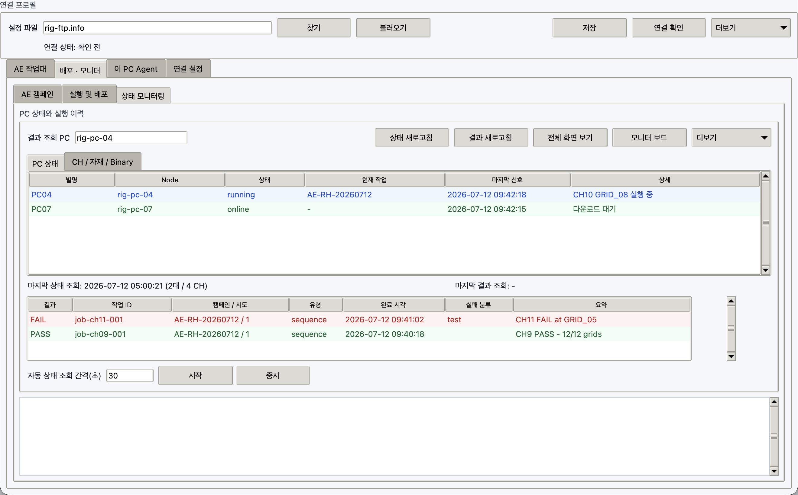

# 상태 모니터링과 캡처

예시에서 `PC04`는 실행 중이고 `PC07`은 online 대기 상태입니다. 아래 결과 표는 CH11
FAIL과 CH9 PASS를 원래 job ID, 캠페인/시도, 완료 시각과 함께 보여줍니다.

## 상태 새로고침

1. master PC에서 `RigFtpCommander.exe`를 실행합니다.
2. `모니터 및 실행 > 상태 모니터링`을 엽니다.
3. `상태 새로고침`을 누릅니다.
4. 상태표의 별명, Node, 상태, 현재 작업, 마지막 신호, 상세 내용을 확인합니다.

상태 영역은 두 보기로 나뉩니다.

| 보기 | 확인 항목 |
| --- | --- |
| `PC 상태` | heartbeat, online/offline, 현재 FTP job, 마지막 결과 |
| `CH / 자재 / Binary` | 자유 CH/이름, Slot, SoC, binary 버전·최신 시각·원본 폴더, DRAM/Lot/Sample, Test, SEQ, 상태, Grid 진행 |

등록했지만 아직 접속하지 않은 PC도 `offline`으로 표시됩니다. 마지막 heartbeat가 polling 주기보다 충분히 오래되면 이전 상태가 `idle`이어도 `offline`으로 바뀝니다. `자동 상태 조회`는 상태만 읽으며 매크로를 전송하거나 실행하지 않습니다.

설정 파일의 CH 메타데이터와 heartbeat의 실행 상태를 CH/slot/name key로 병합합니다. 따라서 slave가 아직 접속하지 않았거나 heartbeat가 stale이어도 SoC, 자재, binary 원본 정보는 표에 남고 상태만 `offline`으로 바뀝니다.

화면 component의 텍스트/색상을 새로 판정하려면 `실행 및 배포`에서 workflow를 선택하고 대상 PC를 지정한 뒤 `상태 규칙 1회`를 누릅니다. 이 job은 클릭, 입력, 키 블록을 제외하고 텍스트/색상/AND/OR 모니터 블록만 실행합니다.

## 결과 로그 보기

1. 상태표에서 PC를 선택하거나 `결과 조회 PC`에 node id를 입력합니다.
2. `결과 새로고침`을 누릅니다.
3. PASS/FAIL 실행 이력 표에서 작업을 더블클릭해 stdout, stderr와 완료 시각을 봅니다.

## 원격 모니터 보드

1. 상태표에서 PC 한 대를 선택합니다.
2. `결과 새로고침`으로 최신 실행 결과를 확인합니다.
3. `모니터 보드`를 누릅니다.
4. workflow에서 지정한 탭별로 `장비 / CH`, 표시 상태, 실제값, 기대값과 PASS/FAIL을 확인합니다.

보드 이름과 탭 순서는 매크로 생성기의 `보드 화면 구성` 값을 따릅니다. `CH9`, `CH11`, `PC04-RIG2` 같은 자유 이름과 CH가 없는 `-` 행을 함께 표시할 수 있습니다. 원격 보드는 slave가 완료해 올린 최신 구조화 결과를 표시하며 실시간 영상 스트리밍은 아닙니다.

구조화 결과에 `completed_grids`와 `total_grids`가 있으면 이를 우선 사용합니다. 텍스트 `3/12`를 읽는 규칙은 block 이름이나 표시 상태에 `GRID`, `PROGRESS`, `그리드`, `진행`을 포함해야 합니다. 이 표식이 없으면 AND/OR 조건 결과의 `1/2 matched`를 Grid 진행률로 오인하지 않습니다. SEQ package 실행 시에는 bundle의 전체 Grid 수가 먼저 등록되고, 실제 완료 수는 SK Commander monitor rule이 읽은 값으로 갱신됩니다.

## screenshot 요청

방법 1:

1. 상태표에서 slave row를 더블클릭합니다.
2. slave가 전체 화면을 캡처해 FTP에 올립니다.
3. master가 PNG를 열어 보여줍니다.

방법 2:

1. `PC 상태와 실행 이력`에서 node를 선택하거나 입력합니다.
2. `전체 화면 보기`를 누릅니다.

요청마다 고유한 job label을 사용하므로 이전 PNG를 새 응답처럼 열지 않습니다. 45초 안에 이번 요청과 정확히 일치하는 파일이 오지 않으면 timeout으로 기록합니다. 최소 요청 간격은 master와 slave 양쪽에서 적용됩니다.

## Excel export

1. `PC 상태와 실행 이력 > 더보기`를 엽니다.
2. `Excel 내보내기`를 누릅니다.
3. `.xlsx` 저장 위치를 선택합니다.

파일에는 `PC State`와 `CH Inventory` 두 시트가 생성됩니다. 두 번째 시트는 SoC, binary provenance, 자재, test/SEQ, 현재/완료/전체 Grid를 행 단위로 내보냅니다.
Campaign ID/제목/attempt, acceptance와 failure class도 같은 CH 행에 포함됩니다.

## AE 실패 분류

결과 행을 선택하고 `더보기 > 선택 결과 분류`를 누르면 자동 분류를 검토하고 담당자,
재시험/보류/종결 조치와 근거를 남길 수 있습니다. 기록은 원본 result JSON이 아니라
`triage/{node}/{job}.json`에 별도로 저장됩니다. 자세한 흐름은
[AE 캠페인 운영](ae-campaign.md)을 참고합니다.

## 오래된 파일 정리

1. `PC 상태와 실행 이력 > 더보기`를 엽니다.
2. `오래된 파일 정리`를 누릅니다.

보관 개수는 `연결 설정`의 결과, 로그, 작업, 화면 보관 개수에서 조정합니다.

## Emergency stop

1. `빠른 실행 > 대상 PC`에 대상 slave를 입력합니다.
2. `긴급 중단`을 누릅니다.
3. 확인창에서 승인합니다.

실행 중인 작업 하나만 정확히 중단하려면 상태표에서 PC를 선택하고 `더보기 > 선택 작업 긴급 중단`을 사용합니다. 전체 stop signal을 해제하려면 `빠른 실행 > 더보기 > 중단 신호 해제`를 사용합니다.
