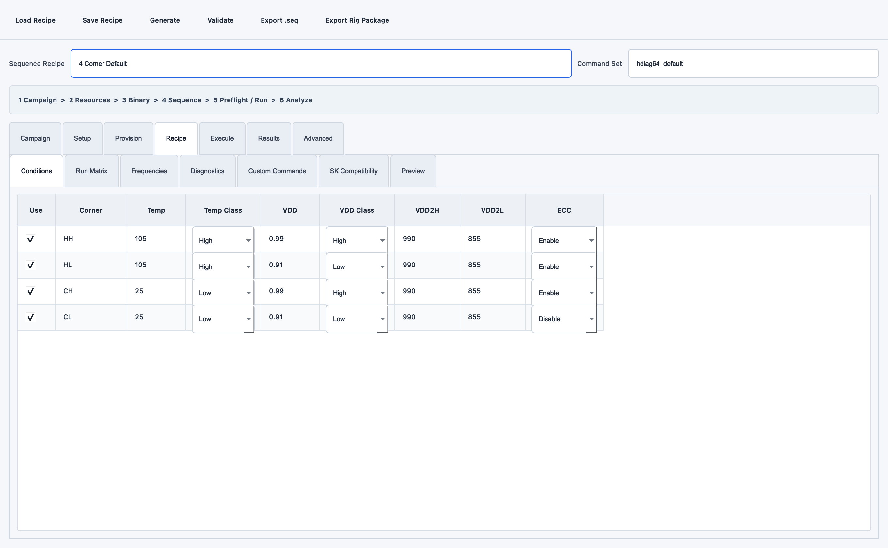
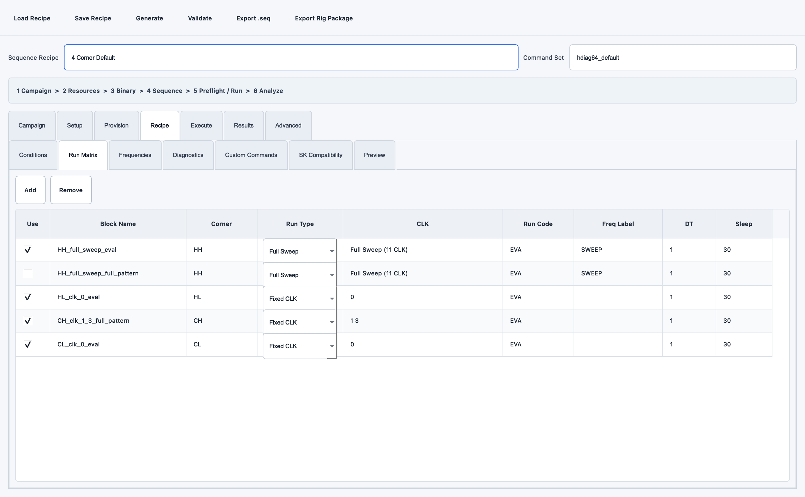
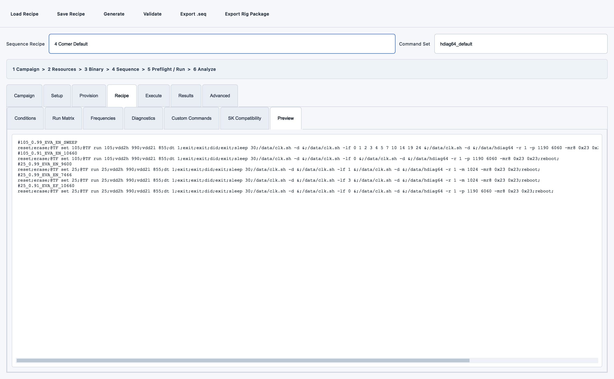

# SEQ Generator와 실장기 실행 연동

Mobile DRAM AE 업무에서 PC 1대에 여러 실장기가 연결된 경우 두 실행 방식을 지원합니다.

```text
TestSeqGenerator.exe
  -> Validate
  -> Export Rig Package (.rigseq.zip)
  -> RigFtpCommander Master
  -> FTP
  -> RigFtpCommander Slave
      -> 직접 COM: 최대 4 CH 병렬 serial 실행
      -> SK Commander: CH/슬롯별 launcher workflow
```

## SEQ 화면에서 확인할 세 가지

### Corner 조건



`Use`가 켜진 행만 생성됩니다. `Temp Class`와 `VDD Class`는 단순 메모가 아니라
4-corner 누락 검사의 기준입니다. 실제 온도 실측값이 아니라 SEQ에 넣을 목표값입니다.

### 실행 블록



한 행이 한 Grid block입니다. `Block Name`, Corner, Run Type, CLK, Run Code, DT, Sleep을
확인하고 불필요한 행은 `Use`를 끕니다.

### 최종 한 줄 문법



Preview에서 각 Grid header 다음 body가 한 줄인지, 각 command가 `;`로 끝나는지,
`;` 뒤에 공백이 없는지 확인합니다. 그 다음 상단 `Validate`를 눌러 compatibility 검사까지
통과한 뒤 `Export Rig Package`를 사용합니다.

## 준비물

| 파일 | 만드는 프로그램 | 용도 |
| --- | --- | --- |
| `*.rigseq.zip` | Test Sequence Generator | 검증된 SEQ, Recipe, 검사 결과, SHA-256을 묶은 배포본 |
| `*.py` workflow | Win Automation Picker | SK Commander 방식을 선택할 때 SEQ를 불러오고 시작하는 UI 자동화 |
| `rig-ftp.info` | Rig FTP Commander | FTP와 Slave PC 목록, 실행표 설정 |
| `*.rigbinary.json` | Test Sequence Generator | 선택 XML의 SoC, 버전, 원본 폴더, 수정 시각, SHA-256 메타데이터 |

## 1. 실행 방식 선택

| 방식 | 필요한 설정 | 적합한 경우 |
| --- | --- | --- |
| `직접 COM` | CH별 Console COM, baud | SEQ command를 serial console에 직접 보낼 수 있고 현장 prompt/timing을 검증한 장비 |
| `SK Commander` | CH별 launcher workflow | 사내 GUI가 SEQ Load/시작을 담당하거나 직접 serial 절차가 아직 검증되지 않은 장비 |

새 SEQ/SoC는 먼저 한 CH에서 직접 console dry-run과 원본 로그를 확보합니다. `직접 COM`은
출력 가능한 ASCII command, `;` 종결, `;` 뒤 무공백을 검사하지만 사내 command 의미나
장비별 대기 시간을 추측하지 않습니다.

### SK Commander 런처 workflow 만들기

Win Automation Picker에서 실제 업무를 한 번 녹화합니다.

1. `연속 녹화 시작`을 누릅니다.
2. 대상 SK Commander에서 `SEQ 불러오기`를 누릅니다.
3. 파일 선택창에서 임시 SEQ를 선택합니다.
4. SK Commander에서 최종 `시작` 버튼까지 누릅니다.
5. Picker로 돌아와 `녹화 정지`를 누릅니다.
6. 파일 경로를 입력하는 블록의 실제 경로를 `${seq_path}`로 바꿉니다.
7. 같은 제목의 창이 여러 개면 창 구분 component의 marker를 `${channel}`로 바꿉니다.
8. `선택 블록 시험`과 전체 `실행`으로 확인한 뒤 Python workflow를 내보냅니다.

`channel=CH11`인 실행 행에서는 selector의 root 이름, AutomationId, class, 창 marker에 포함된 `${channel}`이 모두 `CH11`로 치환됩니다. 모니터 보드의 tab/channel/state 이름도 같은 변수를 사용할 수 있습니다.

CH가 없는 장비는 `channel`을 비워 둡니다. 대신 창 안의 다른 고유 component marker를 사용하거나 슬롯별 런처를 따로 만듭니다.

## 2. SEQ 패키지와 선택 런처 업로드

1. `2 자동화 준비`에서 SEQ를 검사하고, SK Commander 방식이면 Scratch 런처도 준비합니다.
2. `준비 상태 확인` 후 `서버 라이브러리 등록`을 누릅니다.
3. 목록에서 `[FLOW]`와 `[SEQ]`로 구별되는지 확인합니다.
4. SEQ 상세 정보에서 Recipe, Command Set, corner, block/command 수를 확인합니다.

`Field Verified: False`는 패키지 오류가 아니라 실제 장비 성공 자료와 아직 대조되지 않았다는 의미입니다. Grid 한 줄 문법과 설정된 SK compatibility profile 검사는 통과했지만 실제 prompt/timing/protocol 호환성을 보증하지 않습니다.

AE Campaign이 포함된 패키지는 Campaign ID, owner, objective, hypothesis, acceptance,
stop condition, repeat와 preflight 상태도 표시합니다. snapshot hash 또는 preflight가 맞지
않으면 업로드 및 Slave 실행이 거부됩니다.

## 3. 한 PC에 4개 실장기 배정

1. `3 Rig 설정 > Master · 원격 PC > 실장기 연결 PC`에서 PC를 선택하고 `실장기 관리`를 누릅니다.
2. CH9, CH10, CH11, CH12와 Slot, SoC, 자재를 등록합니다.
3. 각 CH의 Console COM과 baud를 반드시 확인합니다.
4. 필요하면 Seq Generator의 `.rigbinary.json`을 선택 CH에 불러옵니다.
5. `[SEQ]` 패키지를 선택하고 상단 `SEQ 방식`을 고릅니다.
6. `직접 COM`이면 바로 `Rig 대상 불러오기`를 누릅니다.
7. `SK Commander`이면 `운영 도구 열기`에서 `[FLOW]` 런처를 고른 뒤 대상을 불러옵니다.
8. 등록된 네 CH가 네 행으로 생겼는지 확인하고 SEQ 방식/COM/입력값을 조정합니다.

Campaign repeat가 2라면 CH마다 attempt 1과 2가 만들어져 네 CH 기준 8행이 됩니다.
전체 상태는 [AE 캠페인 운영](ae-campaign.md) 보드에서 확인합니다.

예:

| 실행 | PC / Node | SEQ / 매크로 | CH | 슬롯 | SEQ 방식 | COM | Baud |
| --- | --- | --- | --- | --- | --- | --- | --- |
| 체크 | rig-pc-04 | four-corner.rigseq.zip | CH9 | S1 | 직접 COM | COM11 | 115200 |
| 체크 | rig-pc-04 | four-corner.rigseq.zip | CH10 | S2 | 직접 COM | COM12 | 115200 |
| 체크 | rig-pc-04 | row-hammer.rigseq.zip | CH11 | S3 | 직접 COM | COM13 | 115200 |
| 체크 | rig-pc-04 | aging.rigseq.zip | CH12 | S4 | 직접 COM | COM14 | 115200 |

같은 Node ID를 여러 행에 사용하는 것이 정상입니다. 같은 Campaign/attempt의 직접 COM 행은
최대 네 개가 한 batch job이 되어 동시에 실행됩니다. attempt가 다르면 다음 batch로 분리됩니다.

실행표에는 CH뿐 아니라 `soc_vendor`, `soc_model`, `binary_name`, `binary_version`, `binary_source_path`, `binary_updated_at`, `dram_part`, `lot_id`, `sample_id`, `test_name`, `sequence_name`이 함께 전달됩니다. Slave heartbeat의 같은 CH 행이 이 값과 실행 상태를 유지합니다.

한 PC의 SK Commander UI job은 포커스 충돌을 막기 위해 순서대로 처리됩니다. 런처 workflow는
`SEQ 불러오기 > 시작`까지만 수행하고 종료하는 구성이 적합합니다. 네 SK Commander가 테스트를
시작한 뒤의 장시간 상태 추적은 클릭/입력이 없는 별도 monitor workflow로 수행합니다.

## 4. Slave에서 일어나는 일

Slave는 job을 받으면 다음 순서로 처리합니다.

1. ZIP 크기와 고정 member를 확인합니다.
2. `sequence.seq`와 `recipe.hseq.json`의 SHA-256을 확인합니다.
3. 생성기 validation이 `ok=true`인지 확인합니다.
4. `직접 COM`이면 `;` 문법, 고유 COM과 최대 4 CH 제한을 확인합니다.
5. `SK Commander`이면 `작업 폴더/sequences/{bundle_id}/sequence.seq`에 저장합니다.
6. 선택 방식에 따라 serial batch 또는 런처 workflow를 실행합니다.

### 직접 COM 결과

- 각 CH는 독립 serial session과 thread를 사용합니다.
- 한 CH의 command 오류는 그 CH를 FAIL 처리하지만 다른 CH의 결과 확정은 계속합니다.
- Grid, command, timeout, 제한된 response를 CH별 manifest에 기록합니다.
- `work_dir/serial-results/{job-CH}/console.log`에 해당 CH의 TX/RX를 저장합니다.
- Master 긴급 중단은 batch job ID로 네 CH에 전달되어 다음 stop 확인 시 멈춥니다.

### SK Commander 런처 변수

| 변수 | 값 |
| --- | --- |
| `${seq_path}` | Slave에 저장된 SEQ의 절대 경로 |
| `${channel}` | 실행표의 CH 값 |
| `${slot_id}` | 실행표의 슬롯 값 |
| `${seq_recipe}` | 패키지 Recipe 이름 |
| `${seq_command_set}` | Command Set ID |
| `${campaign_id}` | 패키지의 변경 불가능한 Campaign ID |
| `${campaign_title}` | Campaign 제목 |
| `${campaign_attempt}` | 현재 실행표의 반복 번호 |
| `${campaign_repeat_count}` | 계획된 전체 반복 수 |

직접 COM은 성공한 Grid 수와 PASS/FAIL을 결과 및 heartbeat에 직접 반영합니다. SK Commander
런처가 시작 버튼을 누른 직후에는 상태가 `running`, 완료 수는 `0`이며 실제 `3/12`,
PASS/FAIL은 별도 monitor workflow가 화면 component에서 읽어 heartbeat에 반영해야 합니다.

ZIP을 `extractall`하지 않으므로 패키지 안의 임의 경로가 Slave의 다른 폴더를 덮어쓰지
않습니다. 같은 bundle은 같은 SHA 기반 폴더를 재사용하고, Rig가 만든 정상 형태의 폴더만
최근 50개까지 유지합니다. 직접 serial 결과도 전용 폴더에서 `로그 보관 개수`만큼 유지하며
이름이나 내부 파일이 다른 사용자 폴더는 정리하지 않습니다.

## 5. 모니터링과 중단

- 런처 workflow 마지막에 상태 monitor 블록을 넣으면 실행 결과 JSON에 함께 저장됩니다.
- 별도 monitor-only workflow를 주기 실행하면 클릭/입력 없이 상태만 읽습니다.
- Master의 `긴급 중단`은 실행 중 workflow 또는 직접 serial batch가 다음 stop 확인 시점에 중단되도록 요청합니다.
- 화면이 꼭 필요할 때만 `전체 화면 보기`를 눌러 최신 캡처를 요청합니다.

직접 COM 엔진이 구현되어 있어도 새로운 SoC/SEQ가 현장 검증된 것은 아닙니다. 실제 성공
SEQ, raw serial log, prompt/timing/error marker를 한 CH에서 확보한 뒤 직접 방식을 확대합니다.
증거가 없거나 사내 GUI가 필수인 장비는 SK Commander 방식을 유지합니다.
