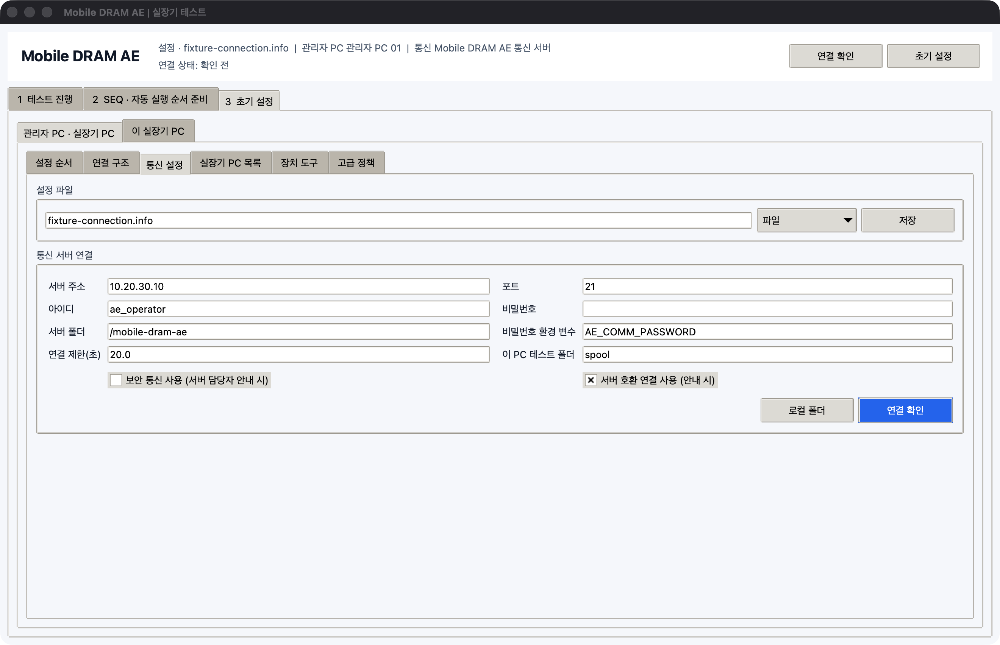

# 관리자 PC 설정

`AEWorkbench.exe`에서 `3 초기 설정 > 관리자 PC · 실장기 PC > 설정 순서`를 엽니다. 이 화면의 1번부터 6번까지 완료하면 됩니다.

## 1. 준비할 정보

설정을 시작하기 전에 아래 값을 확인합니다.

- 관리자 PC의 Windows 이름과 실제 위치
- 통신 서버 주소, 포트, 아이디, 비밀번호, 사용할 서버 폴더
- TFT/UTF 이름: `TFT30`, `TFT31`, `UTF10` 등
- 실장기 PC 이름: `TFT30-1`부터 `TFT30-4` 등
- 각 실장기 PC의 Windows 이름, IP 또는 Host, 실제 위치
- 각 실장기의 번호, COM, Baud rate, USB 식별값

## 2. 통신 설정 저장

1. `3 초기 설정`을 누릅니다.
2. `관리자 PC · 실장기 PC > 설정 순서`에서 `통신 설정 열기`를 누릅니다.
3. 설정 파일은 기본값인 `fixture-connection.info`를 사용합니다.
4. `서버 주소`, `포트`, `아이디`, `비밀번호`를 입력합니다.
5. `서버 폴더`에는 다른 업무 폴더와 겹치지 않는 `/mobile-dram-ae`를 입력합니다.
6. 통신 서버 담당자의 안내가 있을 때만 `보안 통신 사용`, `서버 호환 연결 사용`을 선택합니다.
7. `저장`을 누른 뒤 `연결 확인`을 누릅니다.

`연결됨`이 표시되지 않으면 다음 단계로 넘어가지 않습니다. 비밀번호를 파일에 남기지 않아야 하는 환경에서는 `비밀번호 환경 변수`에 Windows 환경 변수 이름을 입력합니다.

## 3. 관리자 PC 정보 입력

1. `연결 구조`를 엽니다.
2. `관리자 PC`를 선택하고 `선택 수정`을 누릅니다.
3. 식별값, 표시 이름, Windows 이름, 실제 위치를 입력합니다.
4. `설정 저장`을 누릅니다.

Windows 이름은 명령 프롬프트의 `hostname` 결과와 같아야 합니다. 이 값이 맞아야 어느 PC에서 수정한 정보인지 구별할 수 있습니다.

## 4. TFT/UTF와 실장기 PC 등록

1. `실장기 PC 목록`을 엽니다.
2. `실장기 PC 추가`를 누릅니다.
3. 다음 예시처럼 입력합니다.

| 입력 항목 | 예시 |
|---|---|
| 구분 | TFT |
| TFT/UTF 이름 | TFT30 |
| 실장기 PC 이름 | TFT30-1 |
| PC 자산 ID | PC-ASSET-TFT30-1 |
| Windows PC 이름 | AE-TFT30-1 |
| IP / Host | 192.168.0.104 |
| 실제 위치 | Mobile AE Lab / TFT30 / PC 1 |

실장기 PC 이름은 반드시 같은 TFT/UTF 이름 뒤에 `-1`부터 `-4`를 붙입니다.

## 5. 실장기 1대씩 등록

1. 목록에서 `TFT30-1`을 선택합니다.
2. `실장기 관리`를 누릅니다.
3. `실장기 추가`를 눌러 `CH1`부터 `CH4`까지 한 대씩 입력합니다.
4. 입력을 마치면 `저장`을 누릅니다.

### 처음에 직접 입력할 기본 정보

| 항목 | 입력 방법 | 예 |
|---|---|---|
| 실장기 번호 | 실제 장비 번호 | CH1 |
| SoC | 실장기의 SoC 이름 | MTK24D, MTK25D, SM8850 |
| DRAM 종류 / Part | 장착 자재의 Part | K3KL9L90CM |
| Lot | 동일 생산 Lot | L2607A |
| 장착 자재 ID | 같은 Lot 안에서 실물을 구별하는 값 | AA-1, SS-2, AS1S1-1 |
| Binary | 현재 올라간 이름과 버전 | AE_2026W28 / R4.2 |
| 고장 상태 | 장비 사용 가능 여부 | 정상, 사용 주의, 사용 불가, 수리 중 |

장착 자재 ID는 자유 형식 문자열입니다. `AA-1`, `AA-2`처럼 번호만 달라도 되고 `AS1S1-1`처럼 문자와 숫자가 섞여도 됩니다. 프로그램은 값을 해석하지 않고 실장기별로 정확히 보관하고 전달합니다.

Binary 정보는 작업자가 직접 입력합니다. 아직 확인하지 못했다면 빈칸으로 저장할 수 있지만 초기 설정 상태는 `확인 필요`로 남습니다. 이름, 버전, 원본 폴더가 바뀌면 저장 시각과 수정한 PC가 자동으로 기록됩니다.

Lot은 같은 생산 묶음 안의 자재를 구별하기 위한 기준이므로 비워 두면 초기 설정이 완료된 것으로 표시되지 않습니다. 같은 Lot의 자재라도 장착 자재 ID는 `AA-1`, `AA-2`처럼 실장기마다 다르게 입력합니다.

### 테스트 중 SK Commander에서 확인할 정보

| 항목 | 확인 방법 | 예 |
|---|---|---|
| 실장기 번호 | 번호가 표시된 텍스트 항목 | CH1 |
| SoC | SoC가 표시된 텍스트 항목 | MTK24D |
| 장착 자재 ID | 자재가 표시된 텍스트 항목 | AA-1 |
| 현재 테스트 | 테스트 이름 텍스트 | Row Hammer 4-Corner |
| 테스트 상태 | 색상 또는 RUN/PASS/FAIL 텍스트 | 진행 중, PASS, FAIL |
| 부팅 단계 | 단계가 표시된 텍스트 항목 | BL1, BL2, LK, OS |

이 값들은 [SK Commander 항목 연결](sk-commander.md)에서 화면 위치를 지정합니다. SK Commander를 최대 4개 띄운 상태에서 각 창의 실장기 번호까지 함께 확인해야 다른 창의 값을 읽지 않습니다.

### 입력값 이름과 실제 값

자동 실행 순서에는 실장기마다 달라지는 값을 `${이름}` 형태로 넣습니다. 이름과 실제 값을 바꾸어 적지 않도록 아래 표를 사용합니다.

| 입력값 이름 | 자동 실행 순서에 적는 형태 | 실장기별 실제 값 예 |
|---|---|---|
| `material_id` | `${material_id}` | CH1=`AA-1`, CH2=`AA-2`, CH3=`AS1S1-1` |
| `sequence_name` | `${sequence_name}` | `RH_4C_SM8850_V04` |
| `dram_part` | `${dram_part}` | `K3KL9L90CM` |
| `lot_id` | `${lot_id}` | `L2607A` |
| `temperature_c` | `${temperature_c}` | `85` |
| `vdd_v` | `${vdd_v}` | `0.95` |

`AA-1`은 CH1에 장착된 자재의 실제 값입니다. 자동 실행 순서에서는 이 값을 `material_id`라는 입력값 이름으로 사용합니다. 같은 SEQ를 CH1부터 CH4에 보내면 각 실장기에 등록된 `material_id`가 자동으로 적용됩니다.

## 6. 번호 범위 확인

기본 번호 범위는 다음과 같습니다.

| 실장기 PC | 실장기 번호 |
|---|---|
| TFT30-1 | CH1 ~ CH4 |
| TFT30-2 | CH5 ~ CH8 |
| TFT30-3 | CH9 ~ CH12 |
| TFT30-4 | CH13 ~ CH16 |

현장 번호가 이 규칙과 다르면 실제 값을 그대로 등록할 수 있습니다. 다만 한 PC에 4대를 초과하면 저장되지 않습니다.

번호가 `CH11` 하나부터 시작하거나 문자 조합으로 관리되는 경우에도 표시된 실제 값을 그대로 사용합니다. 프로그램은 번호의 순서를 강제로 바꾸지 않으며, 일반 범위와 다를 때만 확인 안내를 표시합니다.

## 7. 통신 폴더와 시작 폴더 만들기

1. 상단 `실장기 PC 선택`에 `TFT30-1 TFT30-2`처럼 전달할 PC를 입력합니다.
2. `통신 폴더 준비`를 누릅니다.
3. `시작 폴더 만들기`를 누릅니다.
4. 생성된 각 폴더를 이름이 같은 실장기 PC로 전달합니다.

별도의 압축 파일은 필요하지 않습니다. 프로그램이 만드는 `TFT30-1` 같은 폴더 자체가 해당 실장기 PC의 시작 폴더입니다.

## 8. 정보 동기화 확인

- 관리자 PC에서 실장기 정보를 수정한 뒤 실장기 목록 창의 `저장`과 초기 설정 화면의 `저장`을 차례로 누릅니다. 통신 서버가 설정되어 있으면 최신 정보가 자동으로 반영됩니다.
- 바로 다시 보내려면 `정보 동기화 > 이 PC 정보를 통신 서버에 반영`을 누릅니다.
- 실장기 PC에서 수정한 값을 받으려면 `정보 동기화 > 통신 서버의 최신 정보 받기`를 누릅니다.
- 장착 자재·SoC·고장 상태 같은 기본 정보는 `기본 정보 수정 시각`이 더 최근인 값을 유지합니다.
- Binary 이름·버전·원본 폴더는 기본 정보와 별도로 `Binary 수정 시각`이 더 최근인 값을 유지합니다.
- `기본 정보 수정자`, `수정 위치`, `수정 시각`에서 변경 출처를 확인할 수 있습니다.

## 9. Binary 다운로드 도구 등록

Binary 업데이트 기능을 사용할 때만 설정합니다.

1. `3 초기 설정 > 관리자 PC · 실장기 PC > 장치 도구`를 엽니다.
2. Qualcomm 또는 MediaTek 항목을 선택하고 `수정`을 누릅니다.
3. 사내에서 승인된 다운로드 프로그램의 실행 파일 경로를 입력합니다.
4. 지원하는 실행 방식과 성공·실패 문구를 실제 프로그램 설명에 맞게 입력합니다.
5. `실행 허용`은 경로와 명령을 한 대에서 검증한 뒤에만 켭니다.
6. 실장기 정보의 `Downloader 도구`에 같은 도구 ID를 지정합니다.

프로그램은 등록한 실행 파일과 인자를 그대로 사용합니다. 제조사 전용 명령 형식이 확인되지 않은 상태에서는 임의로 실행하지 않습니다.
