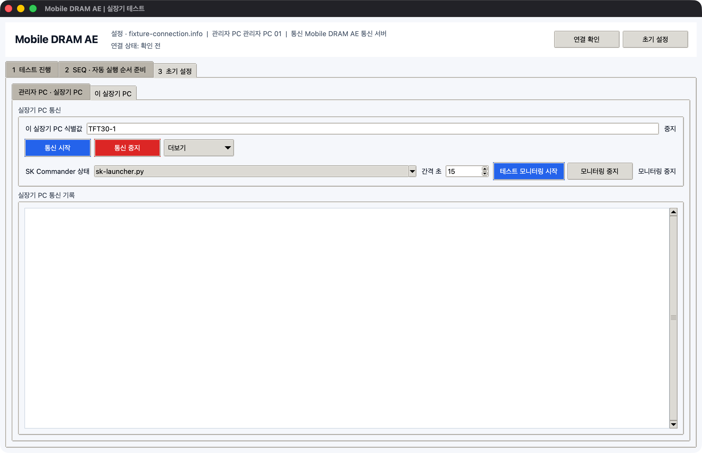

# 실장기 PC 설정

이 작업은 `TFT30-1`처럼 실장기 4대가 연결된 각 Windows PC에서 한 번씩 진행합니다.

## 1. 전달받은 폴더 확인

관리자 PC에서 내보낸 폴더 이름과 실제 PC 이름이 같은지 확인합니다.

```text
TFT30-1/
  AEWorkbench.exe
  fixture-connection.info
  fixture-device.config.json
  README-SETUP.txt
```

네 파일은 한 폴더에 둡니다. 설정 파일 이름을 바꾸지 않습니다.

별도의 압축 파일이나 추가 설정 파일은 필요하지 않습니다. 관리자 PC에서 만든 폴더 이름과 실제 실장기 PC 이름만 일치시키면 됩니다.

각 폴더의 설정에는 폴더 이름과 같은 실장기 PC 한 대와 그 PC에 연결된 실장기만 들어 있습니다. 예를 들어 `TFT30-1` 폴더에는 `TFT30-1`과 `CH1~CH4`만 들어가며, `TFT30-2` 정보는 섞이지 않습니다.

## 2. 프로그램 실행

1. `AEWorkbench.exe`를 실행합니다.
2. Windows 보안 경고가 나오면 사내 승인 절차에 따라 실행을 허용합니다.
3. `3 초기 설정 > 이 실장기 PC`를 엽니다.
4. `이 실장기 PC 식별값`이 실제 이름과 같은지 확인합니다.
5. `통신 시작`을 누릅니다.
6. 상태가 `통신 중: TFT30-1`로 바뀌는지 확인합니다.



프로그램은 요청을 확인할 때만 짧게 통신 서버에 연결합니다. 계속 한 연결을 점유하지 않습니다.

## 3. 연결된 실장기 확인

1. `관리자 PC · 실장기 PC > 연결 구조`를 엽니다.
2. 현재 PC를 선택합니다.
3. `이 PC COM 대조`를 누릅니다.
4. 등록된 COM과 Windows에서 실제로 찾은 COM이 같은지 확인합니다.

다음 값이 실장기마다 달라야 안정적으로 구별할 수 있습니다.

- Console COM
- 예상 COM HWID 또는 USB Serial
- USB Hub / Port / 케이블 라벨
- 실장기 번호

COM 번호만 사용하면 USB를 다시 연결했을 때 다른 실장기로 바뀔 수 있습니다. 가능한 경우 HWID 또는 USB Serial도 함께 등록합니다.

## 4. SK Commander 상태 확인 시작

1. SK Commander를 최대 4개까지 실행합니다.
2. 각 창이 올바른 실장기 번호를 표시하는지 확인합니다.
3. `이 실장기 PC > SK Commander 상태`에서 등록된 자동 실행 순서를 선택합니다.
4. `테스트 모니터링 시작`을 누릅니다.

테스트 중에만 모니터링을 켭니다. 진행 중인 테스트가 없으면 관리자 PC의 자동 모니터링은 스스로 종료됩니다.

## 5. 실장기 정보 수정

현장에서 Binary 또는 장착 자재를 바꾼 경우 다음 순서로 수정합니다.

1. `3 초기 설정 > 관리자 PC · 실장기 PC > 실장기 PC 목록`을 엽니다.
2. 이 PC를 선택하고 `실장기 관리`를 누릅니다.
3. 실장기를 선택하고 `수정`을 누릅니다.
4. 값을 바꾸고 `저장`을 누릅니다.
5. `정보 동기화 > 이 PC 정보를 통신 서버에 반영`을 누릅니다.

관리자 PC가 다음 상태 새로고침을 수행하면 더 최근에 수정한 값이 표시됩니다.

- Binary만 바꾸면 `Binary 수정 시각`을 기준으로 반영됩니다.
- 장착 자재, SoC, 고장 상태를 바꾸면 `기본 정보 수정 시각`을 기준으로 반영됩니다.
- 두 종류는 따로 비교하므로 한쪽에서 최신 Binary를 적고 다른 쪽에서 최신 장착 자재를 적어도 둘 중 하나가 사라지지 않습니다.

## 6. Windows를 다시 시작한 경우

현재 배포본은 Windows 시작 시 자동 실행을 강제로 등록하지 않습니다. PC를 다시 시작한 뒤에는 `AEWorkbench.exe`를 다시 실행하고 `통신 시작`을 눌러야 합니다. 자동 시작이 필요한 현장은 사내 승인된 시작 프로그램 정책으로 바로가기를 등록합니다.
